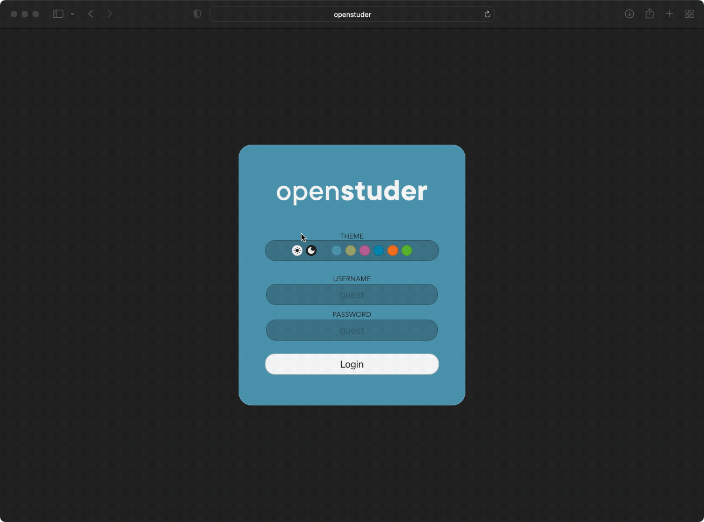

# Quick start

The OpenStuder gateway is the link from the IT world to a Studer Innotec installation. With this gateway, the devices of your Studer Innotec installation can be accessed.

This chapter contains the very basic commands to run in order to install and configure a gateway for a Studer Innotec installation.

For more information about the OpenStuder project, please refer to the [introduction](gateway.md#main)

For more details on the installation or how to contribute and modify the code, please refer to the [Build or develop](gateway.md#build-or-develop) chapter.

## Hardware

You will need the following components to get started:


- **A Studer installation** with [Xtender](https://www.studer-innotec.com/en/products/xtender-series/), [VarioTrack](https://www.studer-innotec.com/en/products/variotrack-series/) or
  [VarioString](https://www.studer-innotec.com/en/products/variostring-series/) devices and the 
  [XCom-485i](https://www.studer-innotec.com/en/accessoires/variotrack-series/communication-module-xcom-485i-7397) Modbus interface to access them.
- A **Linux compatible RS485 to USB interface**.  
  Any USB to RS485 cable should work with some tweaking, we recommend using [this cable](https://www.euclide-innovation.com/product-category/cable-modbus-rj45-usb/), as it has already the correct pin 
  configuration in order to connect to the Xcom-485i interface.
- A [Raspberry Pi](https://www.raspberrypi.com), preferable model B+ with a recent installation of [Raspberry Pi OS](https://www.raspberrypi.com/software/).

Connect the **Raspberry Pi** with the **Xcom-485i** interface using the **USB to RS485** cable. The **Xcom-485i** has to be connected to a compatible **Studer Innotec installation**.

If you are new to Linux and/or the Raspberry Pi, have a look at the official [Raspberry Pi documentation](https://www.raspberrypi.com/documentation/computers/getting-started.html) to learn how to 
connect (preferably by SSH) to your Raspberry Pi and execute basic tasks.

## Install gateway software

In order to be able to install the gateway software on your Raspberry Pi, you need to add the openstuder **PPA** (personal package archive):

```bash
> sudo apt update
> sudo apt install ca-certificates
> curl -s --compressed "https://www.openstuder.io/ppa/KEY.gpg" | sudo apt-key add -
> sudo curl -s --compressed -o /etc/apt/sources.list.d/openstuder.list "https://www.openstuder.io/ppa/openstuder.list"
```

Now you can install the openstuder gateway software using:

```bash
> sudo apt update
> sudo apt install openstuder-gateway
```

## Install web interface

Using the **WebSocket API** you can easily develop your own web client for the openstuder gateway, however we provide a standard gateway that you can install pretty easily.

You can install the default web frontend package using:

```bash
> sudo apt update
> sudo apt install openstuder-web
```

The web frontend can be served by any HTTP server.

>[!WARNING]
> This will install the web frontend to `/var/www/html` and replace the files there. So if you want the web frontend
> served from another location, you need to download the compressed archive from
> [here](https://github.com/OpenStuder/openstuder-gateway-webui/releases) and expand it to the desired location.

If installing the  web frontend manually you first need a web server. You can install the webserver of your choice, we will 
install [lighttpd](https://www.lighttpd.net) as we are serving just static content and lighttpd is very resource
saving:

```bash
> sudo apt update
> sudo apt install lighttpd
```

Now you can download the actual release of the web UI and extract it into the `/var/www/html` folder (or another folder, depending on your HTTP server configuration):

```bash
> cd /var/www/html
> wget -qO- https://github.com/OpenStuder/openstuder-gateway-webui/releases/latest/download/openstuder-gateway-webui.tar.bz2 | tar xjv
```

Now you can connect to your Raspberry Pi via a web browser and use the web interface.

## Connect to web frontend and setup

The default web frontend will greet you with the following login screen.


You can choose the theme (light/dark) and accent color to your liking. Then connect to the gateway by using the default username and password.

>[!INFO]
> The default username is `admin` and the default password is `admin`. You should change the password of the admin user.



You can ignore the warning about the missing installation for now, we only need to change the password of the `admin` user.

Using the same user management frontend, you can add new users with different access levels:

- `Basic`: The user can read the basic properties. The user can not change property values.
- `Installer`: The installer or better the owner has access to some more properties and can additionally change their values.
- `Expert`: This user has the same access rights as `Installer`, but has access to more technical properties.
- `Qualified service personal`: This role is only for qualified service personnel, as this gives access to properties that 
  can harm the installation if wrong values are written.

## Configure device access drivers

Before you can actually use the complete web frontend functionality, you need to configure at least the device access drivers. Refer to the 
[Configure gateway software](README.md?id=configure-gateway-software) and [Device access drivers ](drivers.md) chapters
for more information.

## Web frontend functionality

The default web frontend offers some basic functionality once the device access driver configuration has been completed.

###  Dashboard

The dashboard shows an overview of the installed Studer system in realtime. On the _left_ it displays the **actual power drawn or injected 
from/to the electrical grid**. On _top_ the **number of installed VarioTrack/VarioString** along with the **total solar power** is displayed.
On the _right_, the **power currently consumed** by the connected consumers is shown. The _bottom_ icon shows the **actual state of charge** of the 
battery and the **current power** that flows into the battery (negative if power is drawn from the battery). In the _center_, there is an illustration
of an Xtender inverter. A number in the lower right corner shows the **number of inverters** installed and the switch in the center of the illustration
allows to **turn on and off all Xtender inverters** on the bus if the currently logged user has the access level Installer or better.


### Datalogs

The datalogs section can be used to display logged property values in charts. The properties that are logged by the gateway and the period between logged values
can be configured. Have a look at the chapter [datalog.conf](README.md?id=datalogconf) for more information to configure those properties. Note that the gateway
comes with a default configuration that logs the most important properties.


### Messages

The messages section shows all messages received by the gateway from any device on the current selected device access.


### Properties

The properties section shows all properties of all devices currently connected to the gateway and allows to modify them if the user has the required access level.


### User management

The user management section allows to create, modify or delete users. Note that this section is only available if the user has the rights to access the UserManagement 
extension.


### WiFi configuration

The WiFi configuration extension is only enabled if you use the openstuder SD card image for the Raspberry Pi. If you installed the software yourself, you need to [enable
the WiFiConfig extension](extensions.md?id=wificonfig) before. If you are using the SD card image, the extension is already enabled and ready to use.


As you can see, you can configure the WiFi client and the WiFi access point. They can be even used in parallel, so you can connect to the openstuder gateway and the gateway
acts as a router and can provide internet via either the WiFi client or the ethernet connection.

### Multiple installations

It is possible to connect any number of studer innotec installations to the same gateway (or virtual or custom device access drivers are configured). If multiple 
installations are connected, the UI will show the new section **Select Installation**, where you can choose the installation to work with. You can change the 
installation at any time later by clicking on the **Select Installation** button in the navigation.


## Start/stop gateway software

The gateway software is started automatically after installation, but you might want to stop or restart the software after having modified the configuration.

You can start the gateway software using:

```bash
> sudo systemctl start sigatewayd
```

You can stop the gateway software using:

```bash
> sudo systemctl stop sigatewayd
```

If you need to see the log output for troubleshooting, use:

```bash
> sudo journalctl -u sigatewayd
```

## Configure gateway software

The files `/etc/openstuder/gateway.conf`, `/ect/openstuder/drivers.conf` and `/ect/openstuder/datalog.conf` contain the gateway configuration.

### gateway.conf

The file `/etc/openstuder/gateway.conf` holds the basic configuration for the gateway itself. The default configuration of the gateway allows access to all basic properties to everyone and 
authorization is disabled. You can modify the file if you like to change the default access level to **Installer** (=owner) in order be able to control the devices or change other general 
settings.

### drivers.conf

The file `/ect/openstuder/drivers.conf` contains the configuration for all drivers. A gateway can be connected to multiple Studer installations, so this file lists all connected installations and
the configuration how to access them. The default configuration is empty, you need to add a driver configuration here in order to be able to access real devices. 

Here an example configuration to access devices over the Xcom-485i interface (default baud rate): 

```ini
[xcom]
driver = Xcom485i
port = /dev/ttyUSB0
baudRate = 9600
```

### datalog.conf

The last configuration file `/ect/openstuder/datalog.conf` defines which values will be logged to the integrated database. The format is very simple, using the keyword **interval <seconds>** you can
define groups of properties which will be logged to the database at the given *seconds* interval. Such a group contains the list of properties including wildcard support.

The following default configuration will be installed automatically:

```
interval 300
*.*.3136
*.*.3137
*.*.11004
*.*.15010
*.*.7002
*.*.7003
```

`interval 300` defines a group of properties that were logged every 5 minutes (300 seconds). Every property ending with *3136*, *3137*, *11004*, *15010*, *7002* and *7003* will be logged to the
database at the given interval.

For more details, refer to the [Configuration](gateway.md#configuration) chapter.

## User management on CLI

### List users

In order to get the list of all users along with their access privileges do:

```bash
> sigwctl user list
```

This will show the list of users along with their access rights `Basic`, `Installer`, `Expert` or `QSP` (for qualified service personnel).

### Add a new user

In order to add a new user, do:

```bash
> sudo sigwctl user add <user>
```

This will ask you the password on the desired access level on the console.

### Change the password of a user

If you want to override the actual password of an existing user, you can do:

```bash
> sudo sigwctl user pw <user>
```

This will ask for the new password and replace the existing one of the given user.

### Change the access level of a user

If you need to change the actual access level of an existing user, do:

```bash
> sudo sigwctl user al <user>
```

This will ask for the new access level update the given existing user.

### Remove a user

You can remove a user using:

```bash
> sudo sigwctl user rm <user>
```

Please, refer to [User Management](gateway.md#user-management) for more details.
