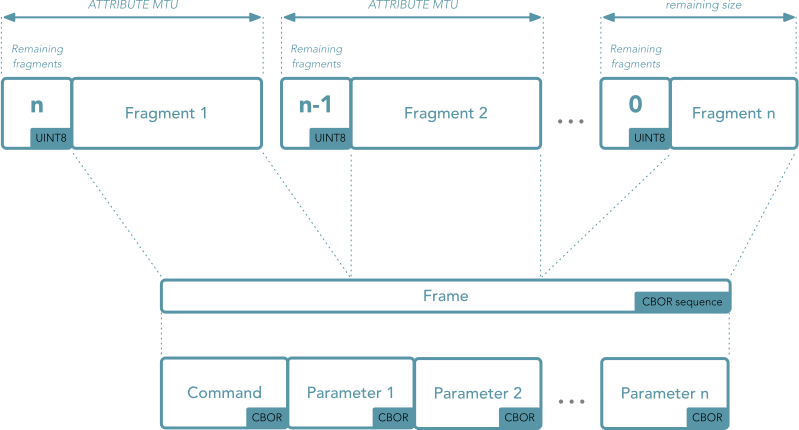
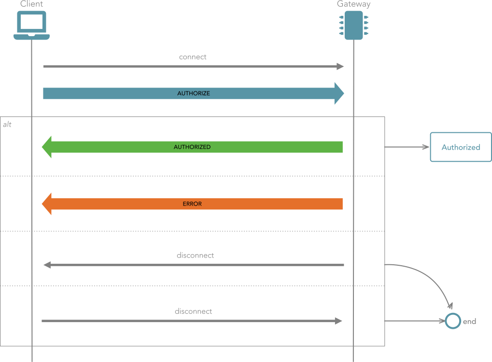
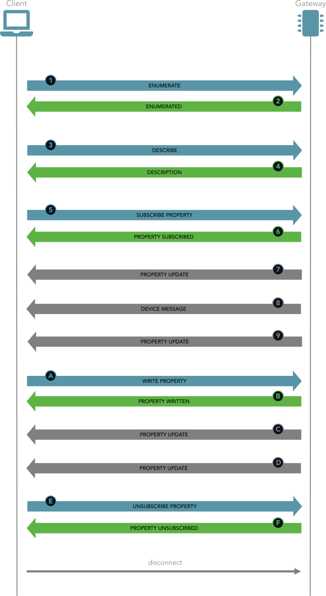

<!--suppress CssUnresolvedCustomProperty -->

## Introduction
 
 

> [!ATTENTION]
> The **Bluetooth API** is still in **early development**, so it is only available in this form in the actual develop branch of the gateway software, it can change at any time, and the documentation
> here is far from complete. Additionally, no official clients exist yet.

 
 

    The OpenStuder Bluetooth protocol is a frame based protocol, where all frames are encoded as <a href="https://tools.ietf.org/html/draft-ietf-cbor-sequence-01">CBOR sequences</a>. 
    A frame consists of a command and a variable set of parameters depending the actual command. All data, including the command is encoded using <a href="http://cbor.io">CBOR</a>.

    The frames are exchanged using two <a href="https://de.wikipedia.org/wiki/Bluetooth_Low_Energy">Bluetooth Low Energy</a> characteristics, one characteristic is dedicated to send frames to the 
    gateway by <bold>writing</bold> to it, the other is used to receive frames from the gateway using the Bluetooth Low Energy <strong>notifications</strong>. This means that the client has to 
    subscribe to the characteristic used to send frames from the gateway to the client in order to be able to receive messages.   

    The Gateway exposes the OpenStuder Bluetooth service using the service UUID <strong style="font-size: 120%">f3c2d800-8421-44b1-9655-0951992f313b</strong>. 

    The UUID of the characteristic used to receive data from the Gateway (RX) is <strong class="response" style="font-size: 120%">f3c2d801-8421-44b1-9655-0951992f313b</strong>. A client has to 
    enable notifications on that characteristic in order to receive those.

    The UUID for sending data to the Gateway (TX) is <strong class="request" style="font-size: 120%">f3c2d802-8421-44b1-9655-0951992f313b</strong>. A frame can be send to the gateway by writing to 
    this characteristic.

## Frame format

    The Bluetooth LE central and the Gateway peripheral will communicate using frames sent over the bluetooth connection. As the content of a frame can be bigger than the Bluetooth LE MTU for GATT 
    attributes, the frames are split up into multiple <strong>fragments</strong>. Each fragment starts with an unsigned 8-bit integer set to the number of fragments that remain to be transmitted for 
    the current frame, the remaining bytes of the bluetooth message are the fragment's data itself.

    The following image illustrates the fragmentation and the format of a frame:

    Atfer having assembled all fragments, the actual frame starts with a command encoded as CBOR integer. Following the command are zero or more parameters, whereas every parameter itself is encoded 
    as a CBOR value according to the CBOR sequence specification. All parameters have to be present, even if they are optional for the given command. It is still possible to provide no value for an 
    optional parameter by encoding the value as <strong>null</strong>.

    The gateway only supports a subset of CBOR types:

- **null**
- **bool**
- **integer**
- **number**
- **double**
- **string**
- **list** *(currently only direction gateway -> client)*
- **map** *(currently only direction gateway -> client)*

    The set of parameters and their datatypes are defined for each command in this document.

## Behavior

The communication between the client and the gateway has <strong>two principal phases</strong>:

#### Unauthorized phase

As soon as client has established the Bluetooth connection to the gateway, the connection is in the <strong>Unauthorized</strong> phase. In this phase, the gateway rejects all frames except
    <strong>AUTHORIZE</strong> requests from the client. This phase is only left after the client has send an <strong>AUTHORIZE</strong> request to the gateway and the gateway granted access or the
    Bluetooth connection has been closed by either the client or the gateway. The gateway can close the Bluetooth connection after one or more refused authorize attempts.

#### Authorized phase

If the gateway has granted access to the client, the connection enters the <strong>Authorized</strong> phase and remains there until either of the two communication peers close the Bluetooth
    connection. In this phase the client can send any request (except the AUTHORIZE request of course) at any time and the gateway responds accordingly. Additionally the gateway can send indication
    frames at any time.

The following sequence diagram shows a typical conversation between a client and the gateway in during the authorized phase:

The client sends a <strong>ENUMERATE</strong> &nbsp;1&nbsp; request frame to the gateway. The gateway will initiate the enumeration operation.

Once the enumeration operation has completed, the gateway responds with an <strong>ENUMERATED</strong> &nbsp;2&nbsp; frame.

The client sends a <strong>DESCRIBE</strong> &nbsp;3&nbsp; request frame to the gateway. The gateway will generate a JSON representation of the
    requested entity.

The gateway responds with an <strong>DESCRIPTION</strong> &nbsp;4&nbsp; frame which contains the description.

The client subscribes now to the properties he is interested in using <strong>SUBSCRIBE PROPERTY</strong> &nbsp;5&nbsp; frames.
    For simplicity the client in the sequence diagram only subscribes to one singe property.

For each property subscribe request, the gateway responds with a <strong>PROPERTY SUBSCRIBED</strong> &nbsp;6&nbsp; frame.

Every time the subscribed property changes, the gateway sends a <strong>PROPERTY UPDATE</strong> &nbsp;7&nbsp;,
    &nbsp;9&nbsp;, &nbsp;C&nbsp;, &nbsp;D&nbsp; frame to the client.

In the case a device connected to the gateway publishes a frame, the frame will be forwarded to all connected clients (authorized) using the <strong>DEVICE MESSAGE</strong>
    &nbsp;8&nbsp; frame.

If a client wants to change the value of a property, he has to send a <strong>WRITE PROPERTY</strong> &nbsp;A&nbsp; frame to tge gateway.

The gateway responds to the property write request using the <strong>PROPERTY WRITTEN</strong> &nbsp;B&nbsp; frame.

The client sends an <strong>UNSUBSCRIBE PROPERTY</strong> &nbsp;E&nbsp; frame to the gateway to stop periodic updates for the given property.

The gateway acknowledges the unsubscribe request by sending a <strong>PROPERTY UNSUBSCRIBED</strong> &nbsp;F&nbsp; frame back to the client.

The client can disconnect from the gateway at any time.

## Frames

    All frames that can be exchanged with the OpenStuder gateway Bluetooth API are defined in the following sections.

Four types of frames exists and are differentiated using colors:

<ul>
    <li><strong class="request">Request frames</strong> send from the client to the gateway.</li>
    <li><strong class="response">Response frames</strong> send from the gateway to the client as response to request frames.</li>
    <li><strong class="indication">Indication frames</strong> send from the gateway to the client spontaneous, subscribed properties and device frame for example.</li>
    <li><strong class="error">Error frames</strong> send from the gateway to the client on severe errors.</li>
</ul>

### User authorization

A client initiates the connection to the gateway by sending the <strong>AUTHORIZE</strong> frame:

    <button class="accordion-toggle">AUTHORIZE</button>
    

        

            The <strong>AUTHORIZE</strong> frame has to be send as the <strong>very first</strong> by a client to the gateway after the Bluetooth connection has been established. Any other frame
            will be rejected as long as the authorization has not been completed. 
            It serves basically two purposes:
        

        <ul>
            <li><strong>Negotiate the protocol version</strong> and</li>
            <li><strong>optionally authorize</strong> a user or guest.</li>
        </ul>
        

            If no user credentials (<em>username</em> and <em>password</em>) are passed and user authorization is enabled on the gateway, the user is is authorized as guest. If guest access is
            disabled in the gateway configuration the authorize request will be rejected.
             
            If user authorization is disabled on the gateway, the credentials (<em>username</em> and <em>password</em>) are not required at all and even if they are provided, they will be ignored.
        

        <h6>parameters</h6>
        <table>
            <tr>
                <th>name</th>
                <th>data type</th>
                <th>description</th>
                <th>use value</th>
            </tr>
            <tr>
                <td>user</td>
                <td>string | null</td>
                <td><strong>Username used to authorize</strong>.  
                    If not provided, the connection will be granted guest access level if guest access is enabled on the gateway. </td>
                <td>
                    <input type="text" placeholder="null" data-bt-index="0"></input>
                </td>
            </tr>
            <tr>
                <td>password</td>
                <td>string | null</td>
                <td><strong>Password used to authorize</strong>.  
                    If not provided, the connection will be granted guest access level if guest access is enabled on the gateway.
                </td>
                <td><input type="text" placeholder="null" data-bt-index="1"></input></td>
            </tr>
            <tr>
                <td>protocol_version</td>
                <td>int | null</td>
                <td><strong>Version of the protocol requested by the client</strong>.  
                    If not provided, the protocol version is determined by the gateway.
                </td>
                <td>
                    <select data-bt-index="2" data-bt-type="int">
                        <option value="">null</option>
                        <option value="1">Version 1</option>
                    </select></td>
            </tr>
        </table>
        <pre data-bt-try><code data-bt-preview="1"></code></pre>
    

If the gateway accepts the connection attempt it will respond with a <strong class="response">AUTHORIZED</strong> frame:

    <button class="accordion-toggle">AUTHORIZED</button>
    

        

            The <strong>AUTHORIZED</strong> frame is send by the gateway as a response to the <strong class="request">AUTHORIZE</strong> frame if the authentication was successful. in the case
            of an error, the gateway responds with an <strong class="error">ERROR</strong> frame instead.
        

        <h6>parameters</h6>
        <table>
            <tr>
                <th>name</th>
                <th>data type</th>
                <th>description</th>
            </tr>
            <tr>
                <td>access_level</td>
                <td>1 <em>(Basic)</em>, 2 <em>(Installer)</em>, 3 <em>(Expert)</em>,  4 <em>(QSP)</em></td>
                <td><strong>Access level granted to authorized user</strong>.  
                    This access level has been granted by the gateway to the user (or guest) that was authorized using the optional credentials in the AUTHORIZE frame.
                </td>
            </tr>
            <tr>
                <td>protocol_version</td>
                <td>int</td>
                <td><strong>Protocol version</strong>.  
                    Protocol version used on the gateway's side. Currently only version 1 is supported.
                </td>
            </tr>
            <tr>
                <td>gateway_version</td>
                <td>string</td>
                <td><strong>Gateway software version</strong>.  
                    Version of the gateway OpenStuder software actually runing on the gateway.
                </td>
            </tr>
        </table>
        <pre data-bt-example="129"><code>18810165302E312E30</code></pre>
    

The gateway can reject any connection attempt due to protocol version mismatch or failed authorization. The server responds back with an <strong class="error">ERROR</strong> frame explaining why
    the authorization was rejected. The connection remains open.

### Device enumeration

A client can request a gateway to enumerates all connected devices by sending an <strong>ENUMERATE</strong> frame.

    <button class="accordion-toggle">ENUMERATE</button>
    

        

            An <strong>ENUMERATE</strong> frame triggers a device enumeration on the gateway. 
            The gateway basically scans every configured and functional device access driver for new devices and removes devices that do not respond anymore.
        

        <h6>parameters</h6>
        
<em>No parameters</em>

        <pre data-bt-try><code data-bt-preview="2"></code></pre>
    

If the gateway accepts the request it will respond with a <strong class="response">ENUMERATED</strong> frame:

    <button class="accordion-toggle">ENUMERATED</button>
    

        

            The <strong>ENUMERATED</strong> frame is send by the gateway as a response to an <strong class="request">ENUMERATE</strong> that was accepted by the gateway. The only reason an
            <strong class="error">ERROR</strong> frame is send back by the gateway instead of this frame is if the request frame was malformed or the client is not yet authorized.
        

        <h6>parameters</h6>
        <table>
            <tr>
                <th>name</th>
                <th>data type</th>
                <th>description</th>
            </tr>
            <tr>
                <td>status</td>
                <td>int</td>
                <td><strong>Status of the enumeration operation</strong>.  
                    <strong>0</strong> <em>(Success)</em> if the enumeration operation was successful, <strong>-1</strong> <em>(Error)</em> otherwise.
                </td>
            </tr>
            <tr>
                <td>device_count</td>
                <td>int</td>
                <td><strong>Total count of devices present</strong>.  
                    The total number of devices present on all device access drivers after the enumeration operation.
                </td>
            </tr>
        </table>
        <pre data-bt-example="130"><code>188203</code></pre>
    

Should the <strong class="request">ENUMERATE</strong> frame be malformed or the client is not yet authorized, the gateway responds with an <strong class="error">ERROR</strong> frame instead.

### Discovery and description

A client can query the gateway to retrieve the topology or detailed information about devices and properties of the installation by sending the <strong>DESCRIBE</strong> frame.

    <button class="accordion-toggle">DESCRIBE</button>
    

        

            The <strong>DESCRIBE</strong> frame is send to a gateway to retrieve information about the available devices and their properties. Using the <strong>id</strong> parameter, the client can 
            request information about available device access drivers, a particular device access instance, a device or a property.
        

        <h6>parameters</h6>
        <table>
            <tr>
                <th>name</th>
                <th>data type</th>
                <th>description</th>
                <th>use value</th>
            </tr>
            <tr>
                <td>id</td>
                <td>string | null</td>
                <td><strong>ID of the devices access instance, the device or the property</strong>.  
                    If this is null, the description is a list of the device access instances along with their driver names. 
                    If the ID is just a string in the form <strong>&lt;device access ID&gt;</strong>, the gateway returns the list of devices along with their model. 
                    An ID in the form <strong>&lt;device access ID&gt;.&lt;device ID&gt;</strong> will result in the description of all available properties for the given device. 
                    If the ID is in the form <strong>&lt;device access ID&gt;.&lt;device ID&gt;.&lt;property ID&gt;</strong>, the gateway returns the description of that particular property.
                </td>
                <td>
                    <input type="text" placeholder="null" data-bt-index="0"/>
                </td>
            </tr>
        </table>
        <pre data-bt-try><code data-bt-preview="3"></code></pre>
    

If the gateway accepts the request it will respond with a <strong class="response">DESCRIPTION</strong> frame:

    <button class="accordion-toggle">DESCRIPTION</button>
    

        

            The <strong>DESCRIPTION</strong> frame is send by the gateway as a response to an <strong class="request">DESCRIBE</strong> that was accepted by the gateway. The only reason an
            <strong class="error">ERROR</strong> frame is send back by the gateway instead of this message is if the request frame was malformed or the client is not yet authorized.
        

        <h6>parameters</h6>
        <table>
            <tr>
                <th>name</th>
                <th>data type</th>
                <th>description</th>
            </tr>
            <tr>
                <td>status</td>
                <td>int</td>
                <td><strong>Status</strong>.  
                    <strong>0</strong> <em>(Success)</em> if the description could be successfully generated, <strong>-4</strong> <em>(NoDeviceAccess)</em> if the device access does not exist, 
                    <strong>-3</strong> <em>(NoDevice)</em> if the device does not exist, <strong>-2</strong> <em>(NoProperty)</em> if the queried property does not exist or 
                    <strong>-1</strong> <em>(Error)</em> for all other errors. Note that if a user has no access to a property due to it's access level, the property is considered to not exist.
                </td>
            </tr>
            <tr>
                <td>id</td>
                <td>string | null</td>
                <td><strong>ID of the description's element</strong>.  
                    Copy of he parameter <strong>id</strong> of the <strong class="request">DESCRIBE</strong> frame for which this is the response from the gateway. If the parameter was not set on the
                    message send to the gateway, it will not be set here either.
                </td>
            </tr>
            <tr>
                <td>description</td>
                <td>map | list | null</td>
                <td><strong>Description (listing) of the element requested</strong>.  
                    The content and the data type depend on the type of element for which the description was requested:
                      
                    <ul>
                        <li>
                            <strong>Gateway</strong> <em>(id=null)</em>: 
                            The description is a map of the IDs of all device access instances present as keys and the driver names as values. Keys and values are of type string.  
                        </li>
                        <li>
                            <strong>Device access</strong>: 
                            The description is a map of the IDs of all devices provided by the device access as keys and their model as values. Keys and values are of type string.  
                        </li>
                        <li>
                            <strong>Device</strong>: 
                            The description is a list of all properties provided by the device. Elements are of type int.  
                        </li>
                        <li>
                            <strong>Property</strong>: 
                            The description is a map containing all information about the property requested. The following keys are present:  
                            <ul>
                                <li><strong>type</strong> <em>int</em>: Datatype of the property. 
                                    <ul>
                                        <li><strong>1</strong>: Float</li>
                                        <li><strong>2</strong>: Enum</li>
                                        <li><strong>3</strong>: Bool</li>
                                        <li><strong>4</strong>: Time of day</li>
                                        <li><strong>5</strong>: Days of week</li>
                                        <li><strong>6</strong>: Signal</li>
                                    </ul>
                                     
                                </li>
                                <li><strong>flags</strong> <em>int</em>: Property flags.
                                    <ul>
                                        <li><strong>1</strong>: Readable</li>
                                        <li><strong>2</strong>: Writeable</li>
                                    </ul>
                                     
                                </li>
                                <li><strong>description</strong> <em>string</em>: Description of the property.  </li>
                                <li><strong>unit</strong> <em>optional string</em>: Unit of the property if property has a unit.  </li>
                                <li><strong>values</strong> <em>optional map</em>: Possible values for property if property is of type Enum.</li>
                            </ul>
                        </li>
                    </ul>
                </td>
            </tr>
        </table>
        <pre data-bt-example="131"><label>id=null:</label><code>188300f6a16464656d6f6444656d6f</code></pre>
        <pre data-bt-example="131"><label>id="demo":</label><code>1883006464656d6fa3636261746844656d6f2042535063696e766d44656d6f20696e76657274657263736f6c6944656d6f204d505054</code></pre>
        <pre data-bt-example="131"><label>id="demo.inv":</label><code>001883006864656d6f2e696e768a190bd8190c41190c40190be9190c09190c08190c0b190c0a190587190577</code></pre>
        <pre data-bt-example="131"><label>id="demo.inv.3136":</label><code>1883006d64656d6f2e696e762e33313336a46b6465736372697074696f6e734f75747075742061637469766520706f77657265666c6167730164747970650164756e6974626b57</code></pre>
        <pre data-bt-example="131"><label>id="demo.inv.3132":</label><code>1883006d64656d6f2e696e762e33303332a46b6465736372697074696f6e781a5374617465206f6620617578696c696172792072656c6179203265666c616773016474797065026676616c756573a266436c6f736564fb3ff0000000000000664f70656e6564fb0000000000000000</code></pre>
    

Should the <strong class="request">DESCRIBE</strong> frame be malformed or the client is not yet authorized, the gateway responds with an <strong class="error">ERROR</strong> frame instead.

### Read property

A client can query the actual value of any property by sending the <strong class="request">READ PROPERTY</strong> frame.

    <button class="accordion-toggle">READ PROPERTY</button>
    

        

            The <strong>READ PROPERTY</strong> frame is send to a gateway to retrieve the actual value of a given property. The property is identified by the <strong>id</strong> parameter.
        

        <h6>parameters</h6>
        <table>
            <tr>
                <th>name</th>
                <th>data type</th>
                <th>description</th>
                <th>use value</th>
            </tr>
            <tr>
                <td>id</td>
                <td>string</td>
                <td><strong>ID of the property</strong>.  
                    The ID of the property to read in the form <strong>&lt;device access ID&gt;.&lt;device ID&gt;.&lt;property ID&gt;</strong>.
                </td>
                <td>
                    <input type="text" placeholder="required" data-bt-index="0" data-bt-required/>
                </td>
            </tr>
        </table>
        <pre data-bt-try><code data-bt-preview="4"></code></pre>
    

If the gateway accepts the request it will respond with a <strong class="response">PROPERTY READ</strong> frame:

    <button class="accordion-toggle">PROPERTY READ</button>
    

        

            The <strong>PROPERTY READ</strong> frame is send by the gateway as a response to an <strong class="request">READ PROPERTY</strong> that was accepted by the gateway. The only reason an
            <strong class="error">ERROR</strong> frame is send back by the gateway instead of this frame is if the request frame was malformed or the client is not yet authorized.
        

        <h6>parameters</h6>
        <table>
            <tr>
                <th>name</th>
                <th>data type</th>
                <th>description</th>
            </tr>
            <tr>
                <td>status</td>
                <td>int</td>
                <td><strong>Status</strong>.  
                    <strong>0</strong> <em>(Success)</em> if the property could be successfully read, <strong>-4</strong> <em>(NoDeviceAccess)</em> if the device access instance does not exist, 
                    <strong>-3</strong> <em>(NoDevice)</em> if the device does not exist and <strong>-2</strong> <em>(NoProperty)</em> if the property does not exists. For all other errors, 
                    the general status <strong>-1</strong> <em>(Error)</em> is set.
                </td>
            </tr>
            <tr>
                <td>id</td>
                <td>string</td>
                <td><strong>ID of the property</strong>.  
                    Copy of the parameter <strong>id</strong> of the corresponding <strong class="request">READ PROPERTY</strong> frame.
                </td>
            </tr>
            <tr>
                <td>value</td>
                <td>bool | int | double | string | null</td>
                <td><strong>Value of the property</strong>.  
                    Actual value of the property. Only present if status is <strong>0</strong>.
                </td>
            </tr>
        </table>
        <pre data-bt-example="132"><code>006D64656D6F2E6261742E37303030F94A20</code></pre>
    

Should the <strong class="request">READ PROPERTY</strong> frame be malformed or the client is not yet authorized, the gateway responds with an <strong class="error">ERROR</strong> frame instead.

### Write property

A client can ask the gateway to write to a property by sending the <strong class="request">WRITE PROPERTY</strong> frame.

    <button class="accordion-toggle">WRITE PROPERTY</button>
    

        

            The <strong>WRITE PROPERTY</strong> frame is send to a gateway to change the actual value of a given property. The property is identified by the <strong>id</strong> parameter and the new
            value is passed by the <strong>value</strong> parameter.
        

        <h6>parameters</h6>
        <table>
            <tr>
                <th>name</th>
                <th>data type</th>
                <th>description</th>
                <th>use value</th>
            </tr>
            <tr>
                <td>id</td>
                <td>string</td>
                <td><strong>ID of the property</strong>.  
                    The ID of the property to write in the form <strong>&lt;device access ID&gt;.&lt;device ID&gt;.&lt;property ID&gt;</strong>.
                </td>
                <td>
                    <input type="text" placeholder="required" data-bt-index="0" data-bt-required/>
                </td>
            </tr>
            <tr>
                <td>flags</td>
                <td>0 <em>(No flags)</em> | 1 <em>(Permanent)</em> | null</td>
                <td><strong>Write flags</strong>. 
                    If the <strong>1</strong> <em>(Permanent)</em> flag is set, the value is written to the non-volatile memory of the device. If the flags are not present (null), the default of the
                    gateway is used, which is <strong>1</strong> <em>(Permanent)</em>.
                </td>
                <td>
                    <select data-bt-index="1" multiple>
                        <option value="0">Empty flags</option>
                        <option value="1">Permanent</option>
                    </select>
                </td>
            </tr>
            <tr>
                <td>value</td>
                <td>bool | int | double | string | null</td>
                <td><strong>New value for the property</strong>.  
                    The value to set for the property. This parameter is optional (can be null) as it is possible to write to properties with the data type "Signal" where there is no actual value 
                    written, the write operation rather triggers an action on the device (or bus).
                </td>
                <td>
                    <input type="text" placeholder="null" data-bt-index="2" data-bt-type="auto"/>
                </td>
            </tr>
        </table>
        <pre data-bt-try><code data-bt-preview="5"></code></pre>
    

If the gateway accepts the request it will respond with a <strong class="response">PROPERTY WRITTEN</strong> frame:

    <button class="accordion-toggle">PROPERTY WRITTEN</button>
    

        

            The <strong>PROPERTY WRITTEN</strong> frame is send by the gateway as a response to an <strong class="request">WRITE PROPERTY</strong> that was accepted by the gateway. The only reason
            an <strong class="error">ERROR</strong> frame is send back by the gateway instead of this frame is if the request frame was malformed or the client is not yet authorized.
        

        <h6>parameters</h6>
        <table>
            <tr>
                <th>name</th>
                <th>data type</th>
                <th>description</th>
            </tr>
            <tr>
                <td>status</td>
                <td>int</td>
                <td><strong>Status</strong>.  
                    <strong>0</strong> <em>(Success)</em> if the property could be written to, <strong>-4</strong> <em>(NoDeviceAccess)</em> if the device access instance does not exist, 
                    <strong>-3</strong> <em>(NoDevice)</em> if the device does not exist and <strong>-2</strong> <em>(NoProperty)</em> if the property does not exists. For all other errors, 
                    the general status <strong>-1</strong> <em>(Error)</em> is set.
                </td>
            </tr>
            <tr>
                <td>id</td>
                <td>string</td>
                <td><strong>ID of the property</strong>.  
                    Copy of the parameter <strong>id</strong> of the corresponding <strong class="request">WRITE PROPERTY</strong> frame.
                </td>
            </tr>
        </table>
        <pre data-bt-example="133"><code>1884006C413330332E31312E31343135</code></pre>
    

Should the <strong class="request">WRITE PROPERTY</strong> frame be malformed or the client is not yet authorized, the gateway responds with an <strong class="error">ERROR</strong> frame instead.

### Subscribe to properties

A client can subscribe to a property for changes by sending the <strong class="request">SUBSCRIBE PROPERTY</strong> frame.

    <button class="accordion-toggle">SUBSCRIBE PROPERTY</button>
    

        

            The <strong>SUBSCRIBE PROPERTY</strong> frame is send to a gateway to subscribe to a property and receive indications whenever the property has changed. The property is identified by
            the <strong>id</strong> header.
        

        <h6>parameters</h6>
        <table>
            <tr>
                <th>name</th>
                <th>data type</th>
                <th>description</th>
                <th>use value</th>
            </tr>
            <tr>
                <td>id</td>
                <td>string</td>
                <td><strong>ID of the property</strong>.  
                    The ID of the property to subscribe to in the form <strong>&lt;device access ID&gt;.&lt;device ID&gt;.&lt;property ID&gt;</strong>.
                </td>
                <td>
                    <input type="text" placeholder="required" data-bt-index="0" data-bt-required/>
                </td>
            </tr>
        </table>
        <pre data-bt-try><code data-bt-preview="6"></code></pre>
    

If the gateway accepts the request it will respond with a <strong class="response">PROPERTY SUBSCRIBED</strong> frame:

    <button class="accordion-toggle">PROPERTY SUBSCRIBED</button>
    

        

            The <strong>PROPERTY SUBSCRIBED</strong> frame is send by the gateway as a response to an <strong class="request">SUBSCRIBE PROPERTY</strong> that was accepted by the gateway. The only
            reason an <strong class="error">ERROR</strong> frame is send back by the gateway instead of this frame is if the request frame was malformed or the client is not yet authorized.
        

        <h6>parameters</h6>
        <table>
            <tr>
                <th>name</th>
                <th>data type</th>
                <th>description</th>
            </tr>
            <tr>
                <td>status</td>
                <td>int</td>
                <td><strong>Status</strong>.  
                    <strong>0</strong> <em>(Success)</em> if the subscription could be added, <strong>-2</strong> <em>(NoProperty)</em> if the property does not exists.
                    For any other error, the general status <strong>-1</strong> <em>(Error)</em> is set.
                </td>
            </tr>
            <tr>
                <td>id</td>
                <td>string</td>
                <td><strong>ID of the property</strong>.  
                    Copy of the parameter <strong>id</strong> of the corresponding <strong class="request">SUBSCRIBE PROPERTY</strong> frame.
                </td>
            </tr>
        </table>
        <pre data-bt-example="134"><code>1885006C413330332E31312E33303233</code></pre>
    

Should the <strong class="request">SUBSCRIBE PROPERTY</strong> frame be malformed or the client is not yet authorized, the gateway responds with an <strong class="error">ERROR</strong> frame instead.

For all property subscriptions of a given client, the gateway sends a <strong class="request">PROPERTY UPDATE</strong> frame when the property has changed.

    <button class="accordion-toggle">PROPERTY UPDATE</button>
    

        

            The <strong>PROPERTY UPDATE</strong> frame is send by the gateway to a client whenever a property the client has subscribed to has changed (or read). The property is identified by
            the <strong>id</strong> header and the value is in the <strong>value</strong> parameter.
        

        <h6>parameters</h6>
        <table>
            <tr>
                <th>name</th>
                <th>data type</th>
                <th>description</th>
            </tr>
            <tr>
                <td>id</td>
                <td>string</td>
                <td><strong>ID of the property</strong>.  
                    The ID of the property that has changed (or was read) in the form <strong>&lt;device access ID&gt;.&lt;device ID&gt;.&lt;property ID&gt;</strong>.
                </td>
            </tr>
            <tr>
                <td>value</td>
                <td>bool | int | double | string | null</td>
                <td><strong>Property value</strong>.  
                    The new value of the property.
                </td>
            </tr>
        </table>
        <pre data-bt-example="254"><code>18FE6C413330332E31312E33303233F90000</code></pre>
    

A client can unsubscribe from a property by sending the <strong class="request">UNSUBSCRIBE PROPERTY</strong> frame.

    <button class="accordion-toggle">UNSUBSCRIBE PROPERTY</button>
    

        

            The <strong>UNSUBSCRIBE PROPERTY</strong> frame is send to a gateway to remove a subscription to a property. The property is identified by the <strong>id</strong> header.
        

        <h6>parameters</h6>
        <table>
            <tr>
                <th>name</th>
                <th>data type</th>
                <th>description</th>
                <th>use value</th>
            </tr>
            <tr>
                <td>id</td>
                <td>string</td>
                <td><strong>ID of the property</strong>.  
                    The ID of the property to unsubscribe from in the form <strong>&lt;device access ID&gt;.&lt;device ID&gt;.&lt;property ID&gt;</strong>.
                </td>
                <td>
                    <input type="text" placeholder="required" data-bt-index="0" data-bt-required/>
                </td>
            </tr>
        </table>
        <pre data-bt-try><code data-bt-preview="7"></code></pre>
    

If the gateway accepts the request it will respond with a <strong class="response">PROPERTY UNSUBSCRIBED</strong> frame:

    <button class="accordion-toggle">PROPERTY UNSUBSCRIBED</button>
    

        

            The <strong>PROPERTY UNSUBSCRIBED</strong> frame is send by the gateway as a response to an <strong class="request">UNSUBSCRIBE PROPERTY</strong> that was accepted by the gateway. The
            only reason an <strong class="error">ERROR</strong> frame is send back by the gateway instead of this frame is if the request frame was malformed or the client is not yet authorized.
        

        <h6>parameters</h6>
        <table>
            <tr>
                <th>name</th>
                <th>data type</th>
                <th>description</th>
            </tr>
            <tr>
                <td>status</td>
                <td>int</td>
                <td><strong>Status</strong>.  
                    <strong>0</strong> <em>(Success)</em> if the subscription could be removed, <strong>-2</strong> <em>(NoProperty)</em> if the property does not exist.
                    For any other error as for example there is no subscription present, the general status <strong>-1</strong> <em>(Error)</em> is set.
                </td>
            </tr>
            <tr>
                <td>id</td>
                <td>string</td>
                <td><strong>ID of the property</strong>.  
                    Copy of the parameter <strong>id</strong> of the corresponding <strong class="request">UNSUBSCRIBE PROPERTY</strong> frame.
                </td>
            </tr>
        </table>
        <pre data-bt-example="135"><code>1886006C413330332E31312E33303233</code></pre>
    

Should the <strong class="request">UNSUBSCRIBE PROPERTY</strong> frame be malformed or the client is not yet authorized, the gateway responds with an <strong class="error">ERROR</strong> frame instead.

### Data log access

The gateway can be configured to log selected properties at configurable intervals. The <strong class="request">READ DATALOG</strong> frame can be used to retrieve logged data of a property
from the gateway or the list of properties that are logged.

    <button class="accordion-toggle">READ DATALOG</button>
    

        

            The <strong>READ DATALOG</strong> frame is send to the gateway to retrieve all or a subset of logged data of a given property or the list of properties that are actually logged.
        

        <h6>parameters</h6>
        <table>
            <tr>
                <th>name</th>
                <th>data type</th>
                <th>description</th>
                <th>use value</th>
            </tr>
            <tr>
                <td>id</td>
                <td>string | null</td>
                <td><strong>Property ID</strong>. 
                Global ID of the property for which the logged data will be requested.  
                It has to be in the form <strong>&lt;device access ID&gt;.&lt;device ID&gt;.&lt;property ID&gt;</strong>. 
                If ID is null, the gateway returns the list of the IDs of properties for whose data is available.
                </td>
                <td>
                    <input type="text" placeholder="null" data-bt-index="0"/>
                </td>
            </tr>
            <tr>
                <td>from</td>
                <td>unsigned int | null</td>
                <td><strong>Start date and time to get logged data from</strong>. 
                The date/time encoded as Epoch time (seconds) in UTC. Defaults to 0 (start of the UNIX Epoch) if null.
                </td>
                <td><input type="number" placeholder="null" data-bt-index="1" data-bt-type="int"/></td>
            </tr>
            <tr>
                <td>to</td>
                <td>unsigned int | null</td>
                <td><strong>End date and time to get the logged data to</strong>. 
                The date/time encoded as Epoch time (seconds) in UTC. Defaults to the current date and time if null.
                </td>
                <td><input type="number" placeholder="null" data-bt-index="2" data-bt-type="int"/></td>
            </tr>
            <tr>
                <td>limit</td>
                <td>unsigned int | null</td>
                <td><strong>Maximal number of values to return</strong>. 
                If this value is null or bigger than 1000, the maximal number of values returned is 1000 and if no property ID is given (list available properties) this parameter will be ignored.
                </td>
                <td><input type="number" placeholder="null" data-bt-index="2" data-bt-type="int"/></td>
            </tr>
        </table>
        <pre data-bt-try><code data-bt-preview="8"></code></pre>
    

If the gateway accepts the request it will respond with a <strong class="response">DATALOG READ</strong> message:

    <button class="accordion-toggle">DATALOG READ</button>
    

        

            The <strong>DATALOG READ</strong> frame is send by the gateway as a response to an <strong class="request">READ DATALOG</strong> that was accepted by the gateway. The only reason an
            <strong class="error">ERROR</strong> frame is send back by the gateway instead of this frame is if the request frame was malformed or the client is not yet authorized.
        

        <h6>parameters</h6>
        <table>
            <tr>
                <th>name</th>
                <th>data type</th>
                <th>description</th>
            </tr>
            <tr>
                <td>status</td>
                <td>int</td>
                <td><strong>Status</strong>.  
                    <strong>0</strong> <em>(Success)</em> if the data could be retrieved from the storage or <strong>-1</strong> <em>(Error)</em> on any error.
                </td>
            </tr>
            <tr>
                <td>id</td>
                <td>string | null</td>
                <td><strong>ID of the property</strong>.  
                    Copy of the parameter <strong>id</strong> of the corresponding <strong class="request">READ DATALOG</strong> frame or null if the list contains the logged properties.
                </td>
            </tr>
            <tr>
                <td>count</td>
                <td>int</td>
                <td><strong>Number of data log entries/properties retrieved</strong>.  
                    The Total number of data log entries or the number of IDs of available property logs retrieved from the storage and returned in the following list.
                </td>
            </tr>
            <tr>
                <td>results</td>
                <td>list</td>
                <td><strong>Interleaved list of timestamp/property value or list of properties</strong>.  
                    If a property ID was given in the request frame, the list contains interleaved the timestamp and the property value. The timestamp is the Unix Epoch timestamp UTC, the value is
                    either a bool, an int, a float or a string. 
                    If no property ID was given in the request frame, the list contains all property IDs as strings.
                </td>
            </tr>
        </table>
        <pre data-bt-example="136"><code>1887006d64656d6f2e696e762e33313336058a1b00000178eb476cf0fb3fa16771117e343d1b00000178eb479400fb3fa16771117e343d1b00000178eb47bb10fb3fa16771117e343d1b00000178eb47e220fb3fa16771117e343d1b00000178eb480930fb3fa16771117e343d</code></pre>
    

### Device messages

Devices can publish broadcast messages and the gateway will forward those messages to all connected clients using the <strong class="indication">DEVICE MESSAGE</strong> frame.

    <button class="accordion-toggle">DEVICE MESSAGE</button>
    

        

            The <strong>DEVICE MESSAGE</strong> frame is send by the gateway to all connected clients whenever a device has broadcast a message.
        

        <h6>parameters</h6>
        <table>
            <tr>
                <th>name</th>
                <th>data type</th>
                <th>description</th>
            </tr>
            <tr>
                <td>timestamp</td>
                <td>unsigned int</td>
                <td><strong>Timestamp when the message was received by the gateway</strong> as UNIX Epoch time UTC.
                </td>
            </tr>
            <tr>
                <td>access_id</td>
                <td>string</td>
                <td><strong>ID of the device access instance that received the message</strong>.
                </td>
            </tr>
            <tr>
                <td>device_id</td>
                <td>string</td>
                <td><strong>ID of the device that send the message</strong>.
                </td>
            </tr>
            <tr>
                <td>message_id</td>
                <td>int</td>
                <td><strong>ID of the message</strong>.
                </td>
            </tr>
            <tr>
                <td>message</td>
                <td>string</td>
                <td><strong>Textual representation of the message</strong>.
                </td>
            </tr>
        </table>
        <pre data-bt-example="253"><code>18FD1A0372A562644133303362313118D277415558322072656C617920646561637469766174696F6E</code></pre>
    

The gateway stores all messages received from devices and a client can query the gateway for messages using the <strong class="request">READ MESSAGES</strong> frame.

    <button class="accordion-toggle">READ MESSAGES</button>
    

        

            The <strong>READ MESSAGES</strong> frame is send to the gateway to retrieve all or a subset of stored messages send by devices on all buses in the past.
        

        <h6>parameters</h6>
        <table>
            <tr>
                <th>name</th>
                <th>data type</th>
                <th>description</th>
                <th>use value</th>
            </tr>
            <tr>
                <td>from</td>
                <td>unsigned int | null</td>
                <td><strong>Start date and time to get the device messages from</strong>. 
                The date/time encoded as Epoch time (seconds) in UTC.
                </td>
                <td><input type="number" placeholder="null" data-bt-index="0" data-bt-type="int"/></td>
            </tr>
            <tr>
                <td>to</td>
                <td>unsigned int | null</td>
                <td><strong>End date and time to get the device messages to</strong>. 
                The date/time encoded as Epoch time (seconds) in UTC.
                </td>
                <td><input type="number" placeholder="null" data-bt-index="1" data-bt-type="int"/></td>
            </tr>
            <tr>
                <td>limit</td>
                <td>unsigned int | null</td>
                <td><strong>Maximal number of messages to return</strong>. 
                If not provided the maximal number of messages returned is not limited.
                </td>
                <td><input type="number" placeholder="null" data-bt-index="2" data-bt-type="int"/></td>
            </tr>
        </table>
        <pre data-bt-try><code data-bt-preview="9"></code></pre>
    

If the gateway accepts the request it will respond with a <strong class="response">MESSAGES READ</strong> frame:

    <button class="accordion-toggle">MESSAGES READ</button>
    

        

            The <strong>MESSAGES READ</strong> frame is send by the gateway as a response to an <strong class="request">READ MESSAGES</strong> that was accepted by the gateway. The only reason an
            <strong class="error">ERROR</strong> frame is send back by the gateway instead of this frame is if the request frame was malformed or the client is not yet authorized.
        

        <h6>parameters</h6>
        <table>
            <tr>
                <th>name</th>
                <th>data type</th>
                <th>description</th>
            </tr>
            <tr>
                <td>status</td>
                <td>int</td>
                <td><strong>Status</strong>.  
                    <strong>0</strong> <em>(Success)</em> if the messages could be retrieved from the storage or <strong>-1</strong> <em>(Error)</em> on any error.
                </td>
            </tr>
            <tr>
                <td>count</td>
                <td>int</td>
                <td><strong>Number of device messages retrieved</strong>.  
                    The Total amount of device messages retrieved from the message storage and returned in the message list.
                </td>
            </tr>
            <tr>
                <td>messages</td>
                <td>list</td>
                <td><strong>Array containing the messages in interleaved format</strong>.  
                    For every message this list contains 5 entries:
                    <ol>
                        <li><strong>Timestamp</strong> <em>(unsigned int)</em>: Timestamp when the message was received by the gateway as UNIX Epoch time UTC.</li>
                        <li><strong>Device access ID</strong> <em>(string)</em>:  ID of the device access instance that received the message.</li>
                        <li><strong>Device ID</strong> <em>(string)</em>: ID of the device that send the message.</li>
                        <li><strong>Message ID</strong> <em>(int)</em>: ID of the message.</li>
                        <li><strong>Message</strong> <em>(string)</em>: Textual representation of the message.</li>
                    </ol>
                </td>
            </tr>
        </table>
        <pre data-bt-example="137"><code>18880001851b00000178da82bb406464656d6f63696e7618d175415558322072656c61792061637469766174696f6e</code></pre>
    

