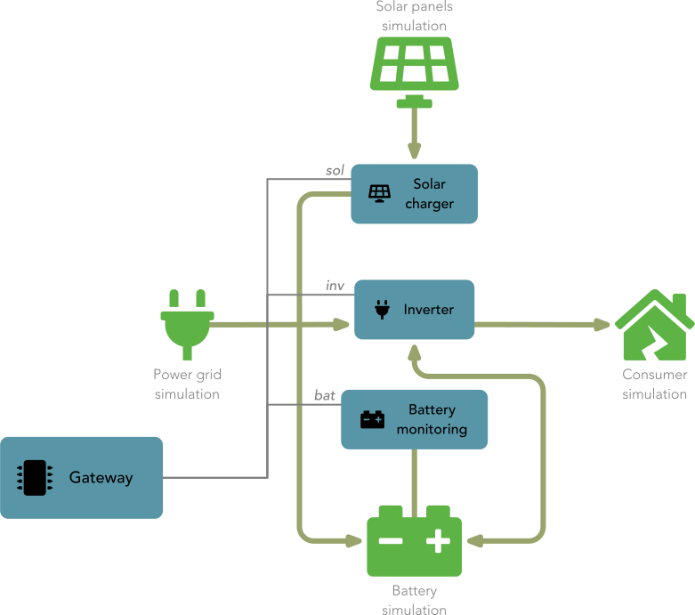

## Device access drivers

**Device access drivers** abstract Studer Innotec installations by communicating with all connected devices using bus converters.

### Xcom485i

Driver to connect to a Studer Innotec [Xcom-485i](https://www.studer-innotec.com/en/accessoires/variotrack-series/communication-module-xcom-485i-7397) bus converter.

Please read the documentation how to connect the bus converter to your installation before you continue here. 

You need a USB to RS485 cable in order to connect the Xcom-485i bus converter to your Raspberry Pi (or any other Linux based computer). You can get them in different sizes from 
[Euclide Innovation](https://www.euclide-innovation.com/product-category/cable-modbus-rj45-usb/), but any other USB to RS485 adapter with an RJ45 connector can be used. If you use another adapter
please check the PIN configuration of the RJ45 connector and configure the Xcom485i bus adapter to match the pinout of the USB cable.

Each device connected to the Xcom-485i bus converter will be made accessible by this driver. The device id matches the virtual Modbus addresses as in the following table:

| (Virtual) Modbus address / ID | Description |
| --- | --- |
| 10 | *Virtual address to access all XTH, XTM and XTS devices present.* |
| 11..19 | A single XTH, XTM or XTS inverter/charger, ordered by the index displayed on the RCC. |
| 20 | *Virtual address to access all VarioTrack devices present.* |
| 21..35 | A single VarioTrack, ordered by the index displayed on the RCC. |
| 40 | *Virtual address to access all VarioString devices present.* |
| 41..55 | A single VarioString, ordered by the index displayed on the RCC. |
| 61 | A single BSP or Xcom-CAN BMS, there can be only one per installation. |

Assuming you have configured a device access driver with the name "`xcom`", you would use the ID `xcom.11.3023` to read the property *3023* from the first inverter on the bus.

#### Parameters

The driver can be configured using three parameters in the respective section inside the `drivers.conf` file:

##### port

Determines the serial port (or virtual USB serial port) to which the Xcom-485i bus adapter is connected. This parameter is **required**.

##### baudRate

Baud rate to use for communication with the Xcom-485i. **Optional**, defaults to *9600* baud which is the default baud rate of the Xcom485i bus adapter. 

> [!Note]
> If you do not have any constraints on the Modbus bus given by other devices, we strongly advice you to switch to the maximal baud rate supported by the Xcom-485i bus adapter, which is 
> **115200** baud. This will greatly improve performance and responsibility of the gateway.

Theoretically the drivers allows any baud rate supported by the host, but the Xcom-485i only support the following baud rates:

- *9600* <--(default)
- *19200*
- *38400*
- *115200* <--(recommended)

##### deviceAddressOffset

Modbus device offset. **Optional**, defaults to *0*.

As the Xtender system can be made of multiple devices, so Studer Innotec decided to implement the addressing of the Studer devices using the Modbus slave address. So, the Xcom-485i will act as a 
gateway and will respond to a certain address range. This address range can be mapped on the Xcom-485i device using dip switches to avoid address collisions with other devices on the shared bus. 

Possible values are:

- *0*
- *32*
- *64*
- *128*

Note that the driver automatically translates the physical device addresses (including offset) into virtual devices (without offest), to from the POV of the gateway, the device addresses are always 
the same whatever settings was choosen for this offset.

> [!Tip]
> If you connect to the Xcom-485i bus converter directly without other devices on the same RS485 bus, leave this at the default.

##### forceSlowEnumeration

The Xcom485i device access driver supports fast device enumeration using Modbus registers that are only present on newer versions of the Xcom-485i bus converter. Normally the driver detects if fast
enumeration is not present and uses the slow enumeration mechanism as fallback. Should that fallback mechanism not work correctly, you can use disable the fast enumeration functionality using this
configuration parameter.

The **optional** parameter can be either `true` or `false` and defaults to `false`.

#### Example

```ini
[xcom]
driver = Xcom485i
port = /dev/ttyUSB0
baudRate = 115200
deviceAddressOffset = 128
forceSlowEnumeration = false
```

Creates a device access instance with the ID `xcom` which connects to `/dev/ttyUSB0` using `115200` baud. An offset of 128 is added to all virtual device addresses. Slow enumeration of devices is not 
forced.

### Demo

Using the **Demo** driver you can test the gateway functionality without the need of an actual installation. This Demo simulates a simple installation featuring solar panels, a solar MPPT 
charger, a battery, a battery monitor and a sinus inverter as shown in the following illustration.



The solar charger can be accessed by the device ID `sol`, the inverter by `inv` and the battery monitor using the ID `bat`.

> [!Note]
> The main focus of the demo driver implementation was to have values that change and not a realistic or accurate simulation.

The **Demo** driver has not parameters. You can instantiate multiple demo instances if you like.

#### Example

```ini
[demo0]
driver = Demo

[demo1]
driver = Demo
```

Instantiates two demo drivers, the first with the ID `demo0` and the second with ID `demo1`.

## Storage drivers

**Storage drivers** store and retrieve property log data and device messages.

### SQLite

The **SQLite** storage driver saves the property value time-series and the device messages into a local [SQLite](https://www.sqlite.org/index.html) database.

#### Parameters

The driver can be configured in the `[Storage]` section inside the `sigateway.conf` configuration file using the following parameters:

##### file

Path and filename of the SQLite database. **Optional**, defaults to */var/lib/openstuder/storage.sqlite*.

##### cleanupInterval

**Optional** interval in seconds at which the storage is cleaned up. This is the interval at which values and messages outside the storage time limit will be removed. The interval defaults to 86400 
seconds which is a day (24 hours).

##### maxStorageDays

Maximal storage duration in days for values and messages. This is the maximal duration data is kept in the storage before deleted to save storage space. This **optional** parameter defaults to 730 
days (about 2 years). 

## Authorize drivers

**Authorize drivers** return an access level based on the user credentials that were provided in the **AUTHORIZE** during client connection setup.

### Internal

The **Internal** authorization driver uses the file `/etc/openstuder/users.txt` to authorize users and `sigwctl` can be used to add, remove or modify users. 

The **Internal** driver has no parameters.
