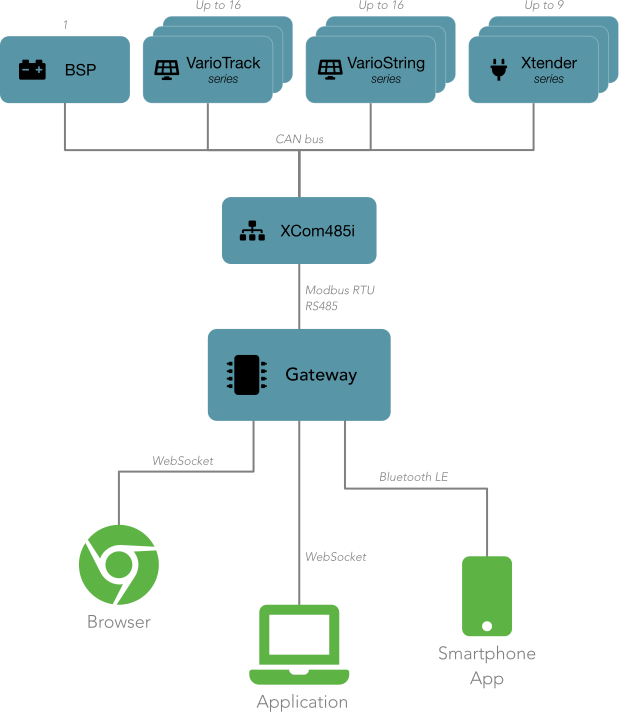

## Introduction

The OpenStuder gateway is the link from the IT world to a Studer Innotec installation. Using a bus converter unit like the 
[XCom-485i](https://www.studer-innotec.com/en/accessoires/variotrack-series/communication-module-xcom-485i-7397), the devices on the Studer [CAN](https://en.wikipedia.org/wiki/CAN_bus) bus can be 
accessed using a simple message-based protocol on top of [WebSockets](https://en.wikipedia.org/wiki/WebSocket) or optionally via a proprietary 
[Bluetooth LE](https://en.wikipedia.org/wiki/Bluetooth_Low_Energy) profile.



Studer Innotec devices are traditionally connected via a proprietary protocol which uses CAN as MAC layer. Direct access to the CAN bus is not possible due to security restrictions enforced by Studer
Innotec. Even if access would be possible, it is much easier to find a USB to RS485 converter that can be connected to a Linux box like for example the [Raspberry Pi](https://www.raspberrypi.org) than
a direct connection to a CAN bus.

> [!Note]
> The gateway uses plugins (called device access drivers) to access devices and busses. This allows a gateway to connect to multiple bus converters at the same time and makes it possible to add
> support for new devices and bus converters without any modification of the gateway software itself.

The device access protocol provided by the Gateway is based on WebSockets - this enables simple access from either websites using the Browsers's Javascript WebSocket API or any application as there 
are WebSocket client libraries available for almost all programming languages and platforms. We provide client implementations for popular languages like Python, Javascript and Typescript.

### Gateway software design

The gateway software consists of a service (daemon) called **sigatewayd** which will connect to the configured Studer Innotec devices and provide access to them via a WebSocket or Bluetooth based API.
The daemon accesses the devices through so called **device access drivers**. These are essentially plugins for each individual device series or each different bus converter, and they allow to access
the data in a uniform way. 

Additionally, **sigatewayd** can be configured to log selected properties at configurable intervals and this data can be queried via the WebSocket of Bluetooth API too. Plugins called 
**storage drivers** are used to persist and query the log data. This enables to use different storage backends and allows to adapt the gateway to different use cases and platforms. The default 
storage driver saves the data into a SQLite database on the filesystem.

The gateway can optionally authorize users when connecting. In order to support different authorization schemes and allow extensibility, this functionality is implemented using plugins called 
**authorize drivers**. The default driver reads the user list, and their access rights from a text file located in the configuration folder.


The fact that access to devices (or busses), data log storage and authorization is implemented using plugins has several advantages:

- The gateway can be configured very flexibly and adapted to all possible environments and constraints.
- Storage drivers allow to save the log data either locally or on a remote server.
- The gateway is extensible, new device drivers, new storage drivers and new authorization mechanisms can be added at any time.

#### Device access driver

A device **access driver** abstracts a Studer Innotec installation by communicating with all connected devices using a bus converter. Typically, one or multiple 
[XCom-485i](https://www.studer-innotec.com/en/accessoires/variotrack-series/communication-module-xcom-485i-7397) bus converters will be used to access installed devices. Support for other bus 
converters and devices might will be added in a future release of the software.

#### Storage driver

A **storage driver** is responsible to store and retrieve property log data and device messages. Depending on the used storage driver, the data can be saved just to memory, persisted to the local 
filesystem (or any mass storage drive), or the data can be saved and retrieved to/from a remote database server.

#### Authorize driver

If user authorization is enabled, an **authorize driver** returns an access level based on the user credentials that were provided in the **AUTHORIZE** message when a client connects to the gateway.
The gateway has a build-in implementation that authorizes against a user text file located in the configuration folder that can be modified using the `sigwctl` command.

## Installation

> [!ATTENTION]
> Currently are no pre-build packages available, so the software has to be compiled and installed manually as described in the [Build or develop](#build-or-develop) chapter.

## Configuration

The configuration of the gateway is divided in two separate configuration files:

- `/etc/openstuder/sigatewayd.conf`: This file contains the general configuration of the gateway daemon itself.
- `/etc/openstuder/drivers.conf`: This file lists the device access drivers to instantiate and their configuration.

If security is enabled, another file `/etc/openstuder/users.txt` contains the list of users along with their password hashes and configured access level. You will have to use the `sigwctl user` CLI 
command to add, list, modify and delete user accounts in that file. 

### Gateway configuration `/etc/openstuder/sigatewayd.conf`

#### Gateway section

The `[Gateway]` section contains general settings for the OpenStuder gateway daemon.

##### driverSearchPaths

Space-separated list of paths where the gateway daemon is searching for **device access**, **storage** and **authorize** plugins. Note that the plugins folders are searched in the order they appear 
in that list.

**Optional**, default value is `/var/lib/openstuder/drivers`.

##### propertyPollInterval

Interval in milliseconds, at which properties with real-time subscriptions (from WebSocket or Bluetooth clients) will be periodically read.

**Optional**, defaults to `10000` (10 seconds).

##### Example

```ini
[Gateway]
driverSearchPaths = /var/lib/openstuder/drivers /home/john/.drivers
propertyPollInterval = 5000
```

In this example, the gateway searches inside the folder `/home/john/.drivers` for drivers if they are not located in the default location `/var/lib/openstuder/drivers`. Properties with subscriptions are read every 5 seconds (5000 ms).

#### Storage section

In the `[Storage]` section, you can configure the storage driver to use and will provide all configuration parameters for that driver. The parameter `driver` specifies the name of the storage driver
to load, all other parameters in this section are passed to the storage driver plugin during initialization.

##### driver

Storage driver to use (log storage).

**Optional**, defaults to `SQLite`.

##### Driver specific settings

All other parameters inside the `[Storage]` section - except the `driver` parameter - are passed to the storage driver during initialization. 
See the respective storage driver documentation for supported configuration parameters.

##### Example

```ini
[Storage]
driver = SQLite
file = /home/john/.storage.sqlite
```

Here we are using the `SQLite` storage driver, and the file is saved as `.storage.sqlite` in user `john`s home folder.

#### WebSocket section

The `[WebSocket]` section contains all settings for the WebSocket API.

##### enabled

If true, the WebSocket API is enabled, if false the WebSocket API is not active and all other settings in this section are not relevant.

**Optional**, default value is `true`.

##### port

TCP port the WebSocket server is listening to.

**Optional**, defaults to `1987`.

##### Example

```ini
[WebSocket]
enabled = true
port = 8080
```

In this example, the WebSocket API is enabled and is listening on port 8080.

#### Bluetooth section

The `[Bluetooth]` section contains all settings for the Bluetooth LE API.

> [!ATTENTION]
> The Bluetooth LE API is still experimental and subject to change. No client libraries are provided yet.

##### enabled

If true, the Bluetooth LE API is enabled, if false the API is not active and all other settings in this section are not relevant.

**Optional**, default value is `false`.

##### name

Name displayed during Bluetooth LE discovery.

**Optional**, defaults to `StuderGW`.

##### Example

```ini
[Bluetooth]
enabled = true
name = A303
```

In this example configuration, the Bluetooth LE API is enabled and the device shows itself with the name `A303`.

#### Authorize section

The `[Authorize]` section contains all settings related to user authorization and user's access levels.

##### enabled

If true, clients can send user credentials (username and password) to authorize and allow user-specific access rights.
If false, credentials are ignored and all client connections will have the access level configured as `guestAccessLevel`.

**Optional**, defaults to `false`.

##### driver

Authorize driver to use.

The `Internal` authorize driver uses a text file located in the configuration folder which can be manipulated using the `sigwctl` command.

**Optional**, defaults to `Internal`. 

##### `guestAccessLevel`

If authorization is disabled (`enabled = false`), every connection is considered as a guest connection and thus this access level is granted to every incoming client connection.

If authorization is enabled (`enabled = true`), this access level is granted to clients which do not provide user credentials (username and password). 
Set this to 'None' to disallow guest connections.

Valid values are:

- `None`: No access at all.
- `Basic`: Basic access level.
- `Installer`: Access level for installers.
- `Expert`: Access to almost all properties.
- `QSP`: Access to all properties for qualified service personnel, prefer not to use as this potentially can harm your installation.

**Optional**, defaults to `Basic`.

##### Driver specific settings

All other parameters inside the `[Authorize]` section - except the `enabled`, the `driver` and the `guestAccessLevel` parameter - are passed to the authorize driver during initialization.
See the respective authorize driver documentation for supported configuration parameters.

##### Example

```ini
[Authorize]
enabled = true
driver = Internal
guestAccessLevel = Expert
```

In this example configuration, authorization is enabled and users are authorized using the `users.txt` text file in the configuration folder. If a client connects as guest, it will have `Expert`
access level.


### Device access driver configuration `/etc/openstuder/drivers.conf`

Each section in this file configures one **access driver**. This enables the gateway to connect to multiple Studer Innotec installations at the same time. The section name is the identifier that
will be attributed to the device access instance. The only parameter which is required for all device access sections is `drive` which identifies the name of the driver to be loaded. All other 
parameters depend the actual driver and you need to consult the documentation of each driver for a list of supported parameters.

#### Example

```ini
[zone0]
driver = XCom485i
port = /dev/ttyUSB0
baudRate = 115200

[zone1]
driver = XCom485i
port = /dev/ttyUSB1
baudRate =57600
```

This example configuration instantiates two device access drivers, the first one called *zone0* with the driver *XCom485i* and a second one called *zone1* using the same driver. The respective 
parameters *port* and *baudRate* are forwarded to the drivers.

## Start and stop daemon

The **Open Studer gateway daemon** is installed as a [systemd](https://www.freedesktop.org/wiki/Software/systemd/) service unit and you can use the standard commands to start and stop the daemon or
check the status or log output.

A typical use case is to stop the daemon, modify it's configuration and then start the daemon again.

#### start

```
> sudo systemctl start sigatewayd
```

#### stop

```
> sudo systemctl stop sigatewayd
```

#### status

```
> sudo systemctl status sigatewayd
```

#### log output

```
> sudo journalctl -u sigatewayd
```

 
## sigwctl

Some tasks related to the OpenStuder gateway functionality can be automated by using the `sigwctl` command line tool.

The tool includes an integrated help function: 

- `sigwctl help` shows an overview of available commands.
- `sigwctl help <command>` shows information about *command*.

### User management

The command line tool can be used to manage user accounts and their respective access level.

> [!Note]
> User accounts are only relevant if security is enabled in the gateway daemon configuration file.

#### sigwctl user list

Lists all existing users with their respective access level.

```
> sigwctl user list
User accounts in "/etc/openstuder/users.txt":
	admin: Expert
	john.doe: Basic
```

#### sigwctl user add *\<user>*

Adds a new user.

The tool will interactively ask the password for the new user and his access level.

> [!TIP]
> You might need to use the command with **sudo** to gain write access to the configuration folder.

```
> sudo sigwctl user add donald.duck
Enter password for user "donald.duck":
Repeat password:
Choose access level:
  0 -> None
  1 -> Basic
  2 -> Installer
  3 -> Expert
  4 -> Qualified service personnel
Your choice: 3
User "donald.duck" added with access level "Expert".
```

#### sigwctl user pw *\<user>*

Changes the password of an existing user.

The tool will interactively ask the password.

> [!TIP]
> You might need to use the command with **sudo** to gain write access to the configuration folder.

```
> sudo sigwctl user pw donald.duck
Enter password for user "donald.duck":
Repeat password:
Changed password for user "donald.duck".
```

#### sigwctl user al *\<user>*

Changes the access level of an existing user.

The tool will interactively ask the access level.

> [!TIP]
> You might need to use the command with **sudo** to gain write access to the configuration folder.

```
> sudo sigwctl user al donald.duck
Choose access level:
0 -> None
1 -> Basic
2 -> Installer
3 -> Expert
4 -> Qualified service personnel
Your choice: 1
Changed password for user to "Basic".
```

#### sigwctl user rm *\<user>*

Removes the user.

> [!TIP]
> You might need to use the command with **sudo** to gain write access to the configuration folder.

```
sudo sigwctl user rm donald.duck
Removed user "donald.duck".
```

## Build or develop

If you like to compile the OpenStuder gateway yourself or if you want to modify the gateway software itself, you can clone or download the source code from the GitHub repository [here](https://github.com/OpenStuder/gateway). However before you are able to do that, you need to prepare your system for OpenStuder gateway development.

Despite the fact that the gateway software has been developed to be platform independent and should work theoretically on all major platforms like [Linux](https://de.wikipedia.org/wiki/Linux), [macOS](https://www.apple.com/chde/macos/) and [Windows](https://www.microsoft.com/windows), this guide has been written for [Raspberry Pi OS](https://www.raspberrypi.org/software/) running on a [Raspberry Pi](https://www.raspberrypi.org) and was only tested on that distribution, but it should work very similar on [Debian Linux](https://www.debian.org/index.de.html) and all Debian based Linux distributions like [Ubuntu](https://ubuntu.com) or [Mint](https://linuxmint.com) for example. 

#### Install dependencies

As a first step, we need to install the dependencies of the software. Basically [git](https://git-scm.com), [GCC](https://gcc.gnu.org), [CMake](https://cmake.org) and the open-source version of the [Qt SDK](https://www.qt.io).

```
> sudo apt update
> sudo apt install \
	git gcc g++ gdb cmake ninja-build \
    qt5-default \
    libqt5serialport5-dev libqt5serialbus5-dev libqt5serialbus5-plugins \
	libqt5websockets5-dev \
	qtconnectivity5-dev
```

#### Clone the repository

```
> git clone https://github.com/OpenStuder/gateway.git
```

##### Branches

The current stable version of the software can be found in the [main](https://github.com/OpenStuder/gateway/tree/main) branch which will be cloned by default, the [develop](https://github.com/OpenStuder/gateway/tree/develop) branch features the latest changes and fixes. If you like to compile a specific version of the software have a look at the [tags](https://github.com/OpenStuder/gateway/tags) present in the repository.

To switch to another branch, you can use your favorite git gui client or use the git CLI:

```
> git branch {branch} origin/{branch}
> git checkout {branch}
```

`{branch}` is the name of the desired branch to switch to.

#### Build the gateway software

```
> cd gateway
> cmake -B build -G Ninja -DCMAKE_BUILD_TYPE=Release
> cmake --build build --target all
```

If you want to build the *debug* version of the software instead of the *release* version, replace  `-DCMAKE_BUILD_TYPE=Release` by `-DCMAKE_BUILD_TYPE=Debug`.

#### Install gateway software

If you desire to install the gateway software on the very same host it was build on, you can build the target **install**.

> [!NOTE]
> You should first build the software in order to ensure that the build process is run by your user and not the root user.

```
> sudo cmake --build build --target install
```

In order to start the gateway, run the following commands:

```
> sudo systemctl daemon-reload
> sudo systemctl start sigatewayd
```

##### Uninstall gateway software

During install, the file **install_manifest.txt** is generated in the build folder. This file lists all installed files, so you can use that file to uninstall the software simply by calling:

```
> sudo xargs rm < install_manifest.txt
```


#### Create package

You can create a *Debian* package that can be installed on other systems without the need to install all the development dependencies.

```
> cmake --build build --target package
```
