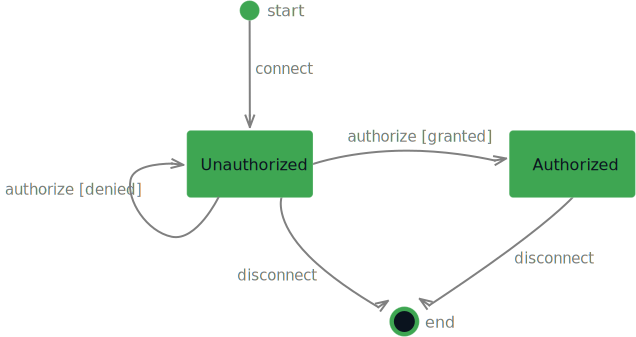
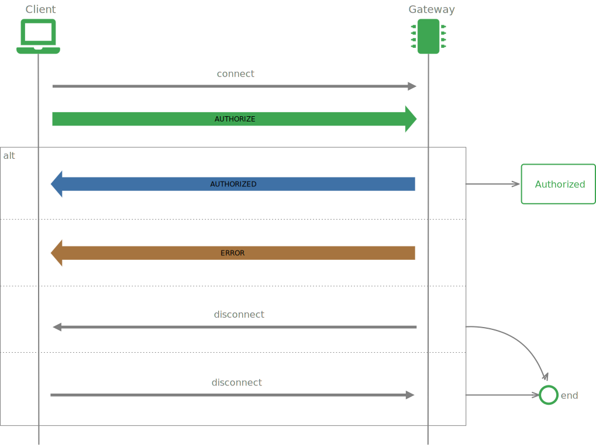
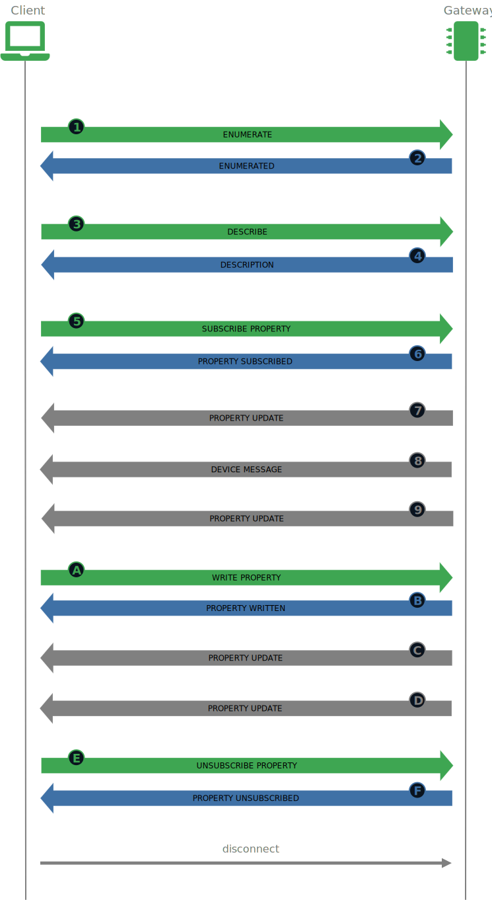

<!--suppress CssUnresolvedCustomProperty -->

## Introduction

    The OpenStuder WebSocket protocol is a message (frame) based protocol, with messages modelled on HTTP. A message consists of a command, a set of optional headers and an optional body and is text
    based to simplify development and debugging. All data is encoded as <strong>UTF-8</strong>.

    The main goals driving the design were simplicity and interoperability. It was designed to be a lightweight protocol that is easy to implement on the client side in a wide range of languages.

## Message format

    The client and server will communicate using messages sent over the WebSocket. A message's structure looks like:

<pre><code>COMMAND
header1:value1
header2:value2

body
</code></pre>

    The frame starts with a command string terminated by a line feed (\n). Following the command are zero or more header entries in <strong>&lt;key&gt;:&lt;value&gt;</strong> format. Each header
    entry is terminated by an line feed (\n). A blank line (i.e. an extra line feed) indicates the end of the headers section and the beginning of the optional body. The body takes the remaining
    space of the message (until message end).

    All commands and header names referenced in this document are <strong>case sensitive</strong>.

## Behavior

The communication between the client and the gateway has <strong>two principal phases</strong>:

#### Unauthorized phase

As soon as client has established the WebSocket connection to the gateway, the connection is in the <strong>Unauthorized</strong> phase. In this phase, the gateway rejects all messages except
    <strong>AUTHORIZE</strong> requests from the client. This phase is only left after the client has send an <strong>AUTHORIZE</strong> request to the gateway and the gateway granted access or the
    WebSocket connection has been closed by either the client or the gateway. The gateway can close the WebSocket connection after one or more refused authorize attempts.

#### Authorized phase

If the gateway has granted access to the client, the connection enters the <strong>Authorized</strong> phase and remains there until either of the two communication peers close the
    connection. In this phase the client can send any request (except the AUTHORIZE request of course) at any time and the gateway responds accordingly. Additionally the gateway can send indication
    messages at any time.

The following sequence diagram shows a typical conversation between a client and the gateway in during the authorized phase:

The client sends a <strong>ENUMERATE</strong> &nbsp;1&nbsp; request message to the gateway. The gateway will initiate the enumeration operation.

Once the enumeration operation has completed, the gateway responds with an <strong>ENUMERATED</strong> &nbsp;2&nbsp; message.

The client sends a <strong>DESCRIBE</strong> &nbsp;3&nbsp; request message to the gateway. The gateway will generate a JSON representation of the
    requested entity.

The gateway responds with an <strong>DESCRIPTION</strong> &nbsp;4&nbsp; message which contains the description.

The client subscribes now to the properties he is interested in using <strong>SUBSCRIBE PROPERTY</strong> &nbsp;5&nbsp; messages.
    For simplicity the client in the sequence diagram only subscribes to one singe property.

For each property subscribe request, the gateway responds with a <strong>PROPERTY SUBSCRIBED</strong> &nbsp;6&nbsp; message.

Every time the subscribed property changes, the gateway sends a <strong>PROPERTY UPDATE</strong> &nbsp;7&nbsp;,
    &nbsp;9&nbsp;, &nbsp;C&nbsp;, &nbsp;D&nbsp; message to the client.

In the case a device connected to the gateway publishes a message, the message will be forwarded to all connected clients (authorized) using the <strong>DEVICE MESSAGE</strong>
    &nbsp;8&nbsp; message.

If a client wants to change the value of a property, he has to send a <strong>WRITE PROPERTY</strong> &nbsp;A&nbsp; message to tge gateway.

The gateway responds to the property write request using the <strong>PROPERTY WRITTEN</strong> &nbsp;B&nbsp; message.

The client sends an <strong>UNSUBSCRIBE PROPERTY</strong> &nbsp;E&nbsp; message to the gateway to stop periodic updates for the given property.

The gateway acknowledges the unsubscribe request by sending a <strong>PROPERTY UNSUBSCRIBED</strong> &nbsp;F&nbsp; message back to the client.

The client can disconnect from the gateway at any time.

## Messages

    All messages that can be exchanged with the OpenStuder gateway WebSocket API are defined in the following sections.

Four types of frames exists and are differentiated using colors:

<ul>
    <li><strong>Request messages</strong> send from the client to the gateway.</li>
    <li><strong class="response">Response messages</strong> send from the gateway to the client as response to request messages.</li>
    <li><strong class="indication">Indication messages</strong> send from the gateway to the client spontaneous, subscribed properties and device message for example.</li>
    <li><strong class="error">Error message</strong> send from the gateway to the client on severe errors.</li>
</ul>

    
Tip

    

        You can connect to a real gateway using the <strong>WebSocket connection</strong> at the bottom of the page and try out each messages interactively by sending them to the gateway and
        see the gateway's response message. The <i class="material-icons">read_more</i> button at the bottom of the message documentation copies the message to the compose section and you can modify
        the message before sending, the <i class="material-icons" style="font-size: 18px;">send</i> button sends the message directly.
    

### User authorization

A client initiates the connection to the gateway by sending the <strong>AUTHORIZE</strong> message:

    <button class="accordion-toggle">AUTHORIZE</button>
    

        

            The <strong>AUTHORIZE</strong> message has to be send as the <strong>very first</strong> by a client to the gateway after the WebSocket connection has been established. Any other message
            will be rejected as long as
            the authorization has not been completed. 
            It serves basically two purposes:
        

        <ul>
            <li><strong>Negotiate the protocol version</strong> and</li>
            <li><strong>optionally authorize</strong> a user or guest.</li>
        </ul>
        

            If no user credentials (<em>username</em> and <em>password</em>) are passed and user authorization is enabled on the gateway, the user is is authorized as guest. If guest access is
            disabled in the gateway configuration the authorize request will be rejected.
             
            If user authorization is disabled on the gateway, the credentials (<em>username</em> and <em>password</em>) are not required at all and even if they are provided, they will be ignored.
        

        <h6>headers</h6>
        <table>
            <tr>
                <th>key</th>
                <th>data type</th>
                <th>description</th>
                <th>use value</th>
            </tr>
            <tr>
                <td>user</td>
                <td>string <em>(optional)</em></td>
                <td><strong>Username used to authorize</strong>.  
                    If not provided, the connection will be granted guest access level if guest access is enabled on the gateway. </td>
                <td>
                    <input type="text" placeholder="no username" data-ws-header="user"></input>
                </td>
            </tr>
            <tr>
                <td>password</td>
                <td>string <em>(optional)</em></td>
                <td><strong>Password used to authorize</strong>.  
                    If not provided, the connection will be granted guest access level if guest access is enabled on the gateway.
                </td>
                <td><input type="password" placeholder="no password" data-ws-header="password"></input></td>
            </tr>
            <tr>
                <td>protocol_version</td>
                <td>number <em>(optional)</em></td>
                <td><strong>Version of the protocol requested by the client</strong>.  
                    If not provided, the protocol version is determined by the gateway.
                </td>
                <td>
                    <select data-ws-header="protocol_version">
                        <option value="">no version</option>
                        <option value="1">Version 1</option>
                    </select></td>
            </tr>
        </table>
        <h6>body</h6>
        
<em>No body</em>

        <pre data-ws-try><code data-ws-preview="AUTHORIZE"></code></pre>
    

If the gateway accepts the connection attempt it will respond with a <strong class="response">AUTHORIZED</strong> message:

    <button class="accordion-toggle">AUTHORIZED</button>
    

        

            The <strong>AUTHORIZED</strong> message is send by the gateway as a response to the <strong class="request">AUTHORIZE</strong> message if the authentication was successful. in the case
            of an error, the gateway responds with an <strong class="error">ERROR</strong> message instead.
        

        <h6>headers</h6>
        <table>
            <tr>
                <th>key</th>
                <th>data type</th>
                <th>description</th>
            </tr>
            <tr>
                <td>access_level</td>
                <td>Basic, Installer, Expert, QSP</td>
                <td><strong>Access level granted to authorized user</strong>.  
                    This access level has been granted by the gateway to the user (or guest) that was authorized using the optional credentials in the AUTHORIZE message.
                </td>
            </tr>
            <tr>
                <td>protocol_version</td>
                <td>number</td>
                <td><strong>Protocol version</strong>.  
                    Protocol version used on the gateway's side. Currently only version 1 is supported.
                </td>
            </tr>
            <tr>
                <td>gateway_version</td>
                <td>string</td>
                <td><strong>Gateway software version</strong>.  
                    Version of the gateway OpenStuder software actually runing on the gateway.
                </td>
            </tr>
        </table>
        <h6>body</h6>
        
<em>No body</em>

        <pre data-ws-example="AUTHORIZED"><code>AUTHORIZED
access_level:Basic
protocol_version:1
 </code></pre>
    

The gateway can reject any connection attempt due to protocol version mismatch or failed authorization. The server responds back with an <strong class="error">ERROR</strong> message explaining why
    the authorization was rejected. The connection remains open.

### Device enumeration

A client can request a gateway to enumerates all connected devices by sending an <strong>ENUMERATE</strong> message.

    <button class="accordion-toggle">ENUMERATE</button>
    

        

            An <strong>ENUMERATE</strong> message triggers a device enumeration on the gateway. 
            The gateway basically scans every configured and functional device access driver for new devices and removes devices that do not respond anymore.
        

        <h6>headers</h6>
        
<em>No headers</em>

        <h6>body</h6>
        
<em>No body</em>

        <pre data-ws-try><code data-ws-preview="ENUMERATE"></code></pre>
    

If the gateway accepts the request it will respond with a <strong class="response">ENUMERATED</strong> message:

    <button class="accordion-toggle">ENUMERATED</button>
    

        

            The <strong>ENUMERATED</strong> message is send by the gateway as a response to an <strong class="request">ENUMERATE</strong> that was accepted by the gateway. The only reason an
            <strong class="error">ERROR</strong> message is send back by the gateway instead of this message is if the request message was malformed or the client is not yet authorized.
        

        <h6>headers</h6>
        <table>
            <tr>
                <th>key</th>
                <th>data type</th>
                <th>description</th>
            </tr>
            <tr>
                <td>status</td>
                <td>string</td>
                <td><strong>Status of the enumeration operation</strong>.  
                    <strong>Success</strong> if the enumeration operation was successful, <strong>Error</strong> otherwise.
                </td>
            </tr>
            <tr>
                <td>device_count</td>
                <td>number</td>
                <td><strong>Total count of devices present</strong>.  
                    The total number of devices present on all device access drivers after the enumeration operation.
                </td>
            </tr>
        </table>
        <h6>body</h6>
        
<em>No body</em>

        <pre data-ws-example="ENUMERATED"><code>ENUMERATED
status:Success
device_count:42
 </code></pre>
    

Should the <strong class="request">ENUMERATE</strong> message be malformed or the client is not yet authorized, the gateway responds with an <strong class="error">ERROR</strong> message instead.

### Discovery and description

A client can query the gateway to retrieve the topology or detailed information about devices and properties of the installation by sending the <strong>DESCRIBE</strong> message.

    <button class="accordion-toggle">DESCRIBE</button>
    

        

            The <strong>DESCRIBE</strong> message is send to a gateway to retrieve information about the available devices and their properties. Using the optional <strong>id</strong>
            header, the client can request information about the whole topology, a particular device access instance, a device or a property. The <strong>flags</strong> header controls the
            level of detail of the gateway's response.
        

        <h6>headers</h6>
        <table>
            <tr>
                <th>key</th>
                <th>data type</th>
                <th>description</th>
                <th>use value</th>
            </tr>
            <tr>
                <td>id</td>
                <td>string <em>(optional)</em></td>
                <td><strong>ID of the devices access instance, the device or the property</strong>.  
                    If not present, the description is for the whole gateway, this means everything connected to the gateway. 
                    If the ID is just a string in the form <strong>&lt;device access ID&gt;</strong>, the gateway returns the description of the given device access instance. 
                    An ID in the form <strong>&lt;device access ID&gt;.&lt;device ID&gt;</strong> will result in the description of the given device. 
                    If the ID is in the form <strong>&lt;device access ID&gt;.&lt;device ID&gt;.&lt;property ID&gt;</strong>, the gateway returns the description of a single property.
                </td>
                <td>
                    <input type="text" placeholder="no id" data-ws-header="id"/>
                </td>
            </tr>
            <tr>
                <td>flags</td>
                <td>IncludeAccessInformation&nbsp;| IncludeDeviceInformation&nbsp;| IncludePropertyInformation&nbsp;| IncludeDriverInformation <em>(optional)</em></td>
                <td><strong>Flags to control description format</strong>.  
                    A comma-separate list (without spaces) of each of those flags can be passed to control the output format of the description.  
                    <strong>IncludeAccessInformation</strong>: Include information about all device access driver instances. 
                    <strong>IncludeDeviceInformation</strong>: Include information about devices. 
                    <strong>IncludePropertyInformation</strong>: Include information about properties. 
                    <strong>IncludeDriverInformation</strong>: Include information about loaded device access drivers.
                </td>
                <td>
                    <select data-ws-header="flags" multiple>
                        <option value="IncludeAccessInformation">Include device access information</option>
                        <option value="IncludeDeviceInformation">Include device information</option>
                        <option value="IncludePropertyInformation">Include device property information</option>
                        <option value="IncludeDriverInformation">Include driver information</option>
                    </select>
                </td>
            </tr>
        </table>
        <h6>body</h6>
        
<em>No body</em>

        <pre data-ws-try><code data-ws-preview="DESCRIBE"></code></pre>
    

If the gateway accepts the request it will respond with a <strong class="response">DESCRIPTION</strong> message:

    <button class="accordion-toggle">DESCRIPTION</button>
    

        

            The <strong>DESCRIPTION</strong> message is send by the gateway as a response to an <strong class="request">DESCRIBE</strong> that was accepted by the gateway. The only reason an
            <strong class="error">ERROR</strong> message is send back by the gateway instead of this message is if the request message was malformed or the client is not yet authorized.
        

        <h6>headers</h6>
        <table>
            <tr>
                <th>key</th>
                <th>data type</th>
                <th>description</th>
            </tr>
            <tr>
                <td>status</td>
                <td>string</td>
                <td><strong>Status</strong>.  
                    <strong>Success</strong> if the description could be successfully generated, <strong>NoDeviceAccess</strong> if the device access does not exist, <strong>NoDevice</strong> if
                    the device does not exist, <strong>NoProperty</strong> if the queried property does not exist or <strong>Error</strong> for all other errors. Note that if a user has no access to
                    a property due to it's access level, the property is considered to not exist.
                </td>
            </tr>
            <tr>
                <td>id</td>
                <td>string <em>(optional)</em></td>
                <td><strong>ID of the description's element</strong>.  
                    Copy of he header <strong>id</strong> of the <strong class="request">DESCRIBE</strong> message for which this is the response from the gateway. If the header was not set on the
                    message send to the gateway, it will not be set here either.
                </td>
            </tr>
        </table>
        <h6>body</h6>
        
The body of the <strong>DESCRIPTION</strong> message is a JSON representation of the requested entity (whole gateway, device access instance, device or property).

<button class="accordion-toggle">Definitions JSON schema</button> Common definitions for all description schemas.

[description_definitions](json/description_definitions.json ':include :type=code')

Download the JSON schema: <a href="json/description_definitions.json" download>description_definitions.json</a>

<button class="accordion-toggle">Global JSON schema</button> ID is empty, so the global description was requested.

[description_global_body](json/description_global_body.json ':include :type=code')

Download the JSON schema: <a class="response" href="json/description_global_body.json" download>description_global_body.json</a>

<button class="accordion-toggle">Device access JSON schema</button> ID refers to a device access instance.

[description_access_body](json/description_access_body.json ':include :type=code')

Download the JSON schema: <a class="response" href="json/description_access_body.json" download>description_access_body.json</a>

<button class="accordion-toggle">Device JSON schema</button> ID refers to a device.

[description_device_body](json/description_device_body.json ':include :type=code')

Download the JSON schema: <a class="response" href="json/description_device_body.json" download>description_device_body.json</a>

<button class="accordion-toggle">Property JSON schema</button> ID refers to a property.

[description_property_body](json/description_property_body.json ':include :type=code')

Download the JSON schema: <a class="response" href="json/description_property_body.json" download>description_property_body.json</a>

<pre data-ws-example="DESCRIPTION"><code>DESCRIPTION
status:Success
&nbsp;
{
  "instances": [
    {
      "devices": [
        {
          "id": "inv",
          "model": "Demo inverter"
        },
        {
          "id": "sol",
          "model": "Demo MPPT"
        },
        {
          "id": "bat",
          "model": "Demo BSP"
        }
      ],
      "driver": "Demo",
      "id": "demo"
    }
  ]
}</code></pre>
    

Should the <strong class="request">DESCRIBE</strong> message be malformed or the client is not yet authorized, the gateway responds with an <strong class="error">ERROR</strong> message instead.

### Read property

A client can query the actual value of any property by sending the <strong class="request">READ PROPERTY</strong> message.

    <button class="accordion-toggle">READ PROPERTY</button>
    

        

            The <strong>READ PROPERTY</strong> message is send to a gateway to retrieve the actual value of a given property. The property is identified by the <strong>id</strong> header.
        

        <h6>headers</h6>
        <table>
            <tr>
                <th>key</th>
                <th>data type</th>
                <th>description</th>
                <th>use value</th>
            </tr>
            <tr>
                <td>id</td>
                <td>string</td>
                <td><strong>ID of the property</strong>.  
                    The ID of the property to read in the form <strong>&lt;device access ID&gt;.&lt;device ID&gt;.&lt;property ID&gt;</strong>.
                </td>
                <td>
                    <input type="text" placeholder="required" data-ws-header="id" data-ws-required/>
                </td>
            </tr>
        </table>
        <h6>body</h6>
        
<em>No body</em>

        <pre data-ws-try><code data-ws-preview="READ PROPERTY"></code></pre>
    

If the gateway accepts the request it will respond with a <strong class="response">PROPERTY READ</strong> message:

    <button class="accordion-toggle">PROPERTY READ</button>
    

        

            The <strong>PROPERTY READ</strong> message is send by the gateway as a response to an <strong class="request">READ PROPERTY</strong> that was accepted by the gateway. The only reason an
            <strong class="error">ERROR</strong> message is send back by the gateway instead of this message is if the request message was malformed or the client is not yet authorized.
        

        <h6>headers</h6>
        <table>
            <tr>
                <th>key</th>
                <th>data type</th>
                <th>description</th>
            </tr>
            <tr>
                <td>status</td>
                <td>string</td>
                <td><strong>Status</strong>.  
                    <strong>Success</strong> if the property could be successfully read, <strong>NoDeviceAccess</strong> if the device access instance does not exist, <strong>NoDevice</strong> if the
                    device does not exist and <strong>NoProperty</strong> if the property does not exists. For all other errors, the general status <strong>Error</strong> is set.
                </td>
            </tr>
            <tr>
                <td>id</td>
                <td>string</td>
                <td><strong>ID of the property</strong>.  
                    Copy of the header <strong>id</strong> of the corresponding <strong class="request">READ PROPERTY</strong> message.
                </td>
            </tr>
            <tr>
                <td>value</td>
                <td>number or string <em>(optional)</em></td>
                <td><strong>Value of the property</strong>.  
                    Actual value of the property. Only present if status is <strong>Success</strong>.
                </td>
            </tr>
        </table>
        <h6>body</h6>
        
<em>No body</em>

        <pre data-ws-example="PROPERTY READ"><code>PROPERTY READ
status:Success
id:A303.11.3023
value:0.1575
 </code></pre>
    

Should the <strong class="request">READ PROPERTY</strong> message be malformed or the client is not yet authorized, the gateway responds with an <strong class="error">ERROR</strong> message instead.

### Read multiple properties

A client can query the actual value of multiple properties by sending the <strong class="request">READ PROPERTIES</strong> message.

    <button class="accordion-toggle">READ PROPERTIES</button>
    

        

            The <strong>READ PROPERTIES</strong> message is send to a gateway to retrieve the actual value of multiple properties at the same time. The properties are identified by their 
            <strong>ids</strong> that are encoded as a JSON array of strings in the body of the message. This message has no headers.
        

         <h6>headers</h6>
        
<em>No headers</em>

        <h6>body</h6>
        
IDs of the properties encoded as a JSON array of strings.

<button class="accordion-toggle">JSON schema</button>

[read_properties_body](json/read_properties_body.json ':include :type=code')

Download the JSON schema: <a href="json/read_properties_body.json" download>read_properties_body.json</a>

        

        

            <em>use value:</em> 
            <textarea placeholder="required" data-ws-body data-ws-required>[]</textarea>
        

        <pre data-ws-try><code data-ws-preview="READ PROPERTIES"></code></pre>
    

If the gateway accepts the request it will respond with a <strong class="response">PROPERTIES READ</strong> message:

    <button class="accordion-toggle">PROPERTIES READ</button>
    

        

            The <strong>PROPERTIES READ</strong> message is send by the gateway as a response to an <strong class="request">READ PROPERTIES</strong> that was accepted by the gateway. The only reason 
            an <strong class="error">ERROR</strong> message is send back by the gateway instead of this message is if the request message was malformed or the client is not yet authorized.
        

        <h6>headers</h6>
        <table>
            <tr>
                <th>key</th>
                <th>data type</th>
                <th>description</th>
            </tr>
            <tr>
                <td>status</td>
                <td>string</td>
                <td><strong>Status</strong>.  
                    <strong>Success</strong> if the operation to read multiple properties could be started. For all errors, the general status <strong>Error</strong> is set.
                </td>
            </tr>
        </table>
        <h6>body</h6>
        
JSON array containing an object for each requested property. Each object in the array contains the id, status and value of the property read operation.

<button class="accordion-toggle">JSON schema</button>

[properties_read_body](json/properties_read_body.json ':include :type=code')

Download the JSON schema: <a href="json/properties_read_body.json" download>properties_read_body.json</a>

        

        <pre data-ws-example="PROPERTIES READ"><code>PROPERTIES READ
status:Success
&nbsp;
[]</code></pre>
    

Should the <strong class="request">READ PROPERTIES</strong> message be malformed or the client is not yet authorized, the gateway responds with an <strong class="error">ERROR</strong> message instead.

### Write property

A client can ask the gateway to write to a property by sending the <strong class="request">WRITE PROPERTY</strong> message.

    <button class="accordion-toggle">WRITE PROPERTY</button>
    

        

            The <strong>WRITE PROPERTY</strong> message is send to a gateway to change the actual value of a given property. The property is identified by the <strong>id</strong> header and the new
            value is passed by the <strong>value</strong> header.
        

        <h6>headers</h6>
        <table>
            <tr>
                <th>key</th>
                <th>data type</th>
                <th>description</th>
                <th>use value</th>
            </tr>
            <tr>
                <td>id</td>
                <td>string</td>
                <td><strong>ID of the property</strong>.  
                    The ID of the property to write in the form <strong>&lt;device access ID&gt;.&lt;device ID&gt;.&lt;property ID&gt;</strong>.
                </td>
                <td>
                    <input type="text" placeholder="required" data-ws-header="id" data-ws-required/>
                </td>
            </tr>
            <tr>
                <td>flags</td>
                <td>Permanent <em>(optional)</em></td>
                <td><strong>Write flags</strong>. 
                    If the <strong>Permanent</strong> flag is set, the value is written to the non-volatile memory of the device. If not present, it defaults to <strong>Permanent</strong>.
                </td>
                <td>
                    <select data-ws-header="flags" multiple>
                        <option value="__EMPTY__">Send flags</option>
                        <option value="Permanent">Permanent</option>
                    </select>
                </td>
            </tr>
            <tr>
                <td>value</td>
                <td>number or string <em>(optional)</em></td>
                <td><strong>New value for the property</strong>.  
                    The value to set for the property. This header is optional as it is possible to write to properties with the data type "Signal" where there is no actual value written, the write
                    operation rather triggers an action on the device (or bus).
                </td>
                <td>
                    <input type="text" placeholder="no value" data-ws-header="value"/>
                </td>
            </tr>
        </table>
        <h6>body</h6>
        
<em>No body</em>

        <pre data-ws-try><code data-ws-preview="WRITE PROPERTY"></code></pre>
    

If the gateway accepts the request it will respond with a <strong class="response">PROPERTY WRITTEN</strong> message:

    <button class="accordion-toggle">PROPERTY WRITTEN</button>
    

        

            The <strong>PROPERTY WRITTEN</strong> message is send by the gateway as a response to an <strong class="request">WRITE PROPERTY</strong> that was accepted by the gateway. The only reason
            an <strong class="error">ERROR</strong> message is send back by the gateway instead of this message is if the request message was malformed or the client is not yet authorized.
        

        <h6>headers</h6>
        <table>
            <tr>
                <th>key</th>
                <th>data type</th>
                <th>description</th>
            </tr>
            <tr>
                <td>status</td>
                <td>string</td>
                <td><strong>Status</strong>.  
                    <strong>Success</strong> if the property could be written to, <strong>NoDeviceAccess</strong> if the device access instance does not exist, <strong>NoDevice</strong> if the
                    device does not exist and <strong>NoProperty</strong> if the property does not exists. For all other errors, the general status <strong>Error</strong> is set.
                </td>
            </tr>
            <tr>
                <td>id</td>
                <td>string</td>
                <td><strong>ID of the property</strong>.  
                    Copy of the header <strong>id</strong> of the corresponding <strong class="request">WRITE PROPERTY</strong> message.
                </td>
            </tr>
        </table>
        <h6>body</h6>
        
<em>No body</em>

        <pre data-ws-example="PROPERTY WRITTEN"><code>PROPERTY WRITTEN
status:Success
id:A303.11.1415
 </code></pre>
    

Should the <strong class="request">WRITE PROPERTY</strong> message be malformed or the client is not yet authorized, the gateway responds with an <strong class="error">ERROR</strong> message instead.

### Subscribe to properties

A client can subscribe to a property for changes by sending the <strong class="request">SUBSCRIBE PROPERTY</strong> message.

    <button class="accordion-toggle">SUBSCRIBE PROPERTY</button>
    

        

            The <strong>SUBSCRIBE PROPERTY</strong> message is send to a gateway to subscribe to a property and receive indications whenever the property has changed. The property is identified by
            the <strong>id</strong> header.
        

        <h6>headers</h6>
        <table>
            <tr>
                <th>key</th>
                <th>data type</th>
                <th>description</th>
                <th>use value</th>
            </tr>
            <tr>
                <td>id</td>
                <td>string</td>
                <td><strong>ID of the property</strong>.  
                    The ID of the property to subscribe to in the form <strong>&lt;device access ID&gt;.&lt;device ID&gt;.&lt;property ID&gt;</strong>.
                </td>
                <td>
                    <input type="text" placeholder="required" data-ws-header="id" data-ws-required/>
                </td>
            </tr>
        </table>
        <h6>body</h6>
        
<em>No body</em>

        <pre data-ws-try><code data-ws-preview="SUBSCRIBE PROPERTY"></code></pre>
    

If the gateway accepts the request it will respond with a <strong class="response">PROPERTY SUBSCRIBED</strong> message:

    <button class="accordion-toggle">PROPERTY SUBSCRIBED</button>
    

        

            The <strong>PROPERTY SUBSCRIBED</strong> message is send by the gateway as a response to an <strong class="request">SUBSCRIBE PROPERTY</strong> that was accepted by the gateway. The only
            reason an <strong class="error">ERROR</strong> message is send back by the gateway instead of this message is if the request message was malformed or the client is not yet authorized.
        

        <h6>headers</h6>
        <table>
            <tr>
                <th>key</th>
                <th>data type</th>
                <th>description</th>
            </tr>
            <tr>
                <td>status</td>
                <td>string</td>
                <td><strong>Status</strong>.  
                    <strong>Success</strong> if the subscription could be added, <strong>NoProperty</strong> if the property does not exists.
                    For any other error, the general status <strong>Error</strong> is set.
                </td>
            </tr>
            <tr>
                <td>id</td>
                <td>string</td>
                <td><strong>ID of the property</strong>.  
                    Copy of the header <strong>id</strong> of the corresponding <strong class="request">SUBSCRIBE PROPERTY</strong> message.
                </td>
            </tr>
        </table>
        <h6>body</h6>
        
<em>No body</em>

        <pre data-ws-example="PROPERTY SUBSCRIBED"><code>PROPERTY SUBSCRIBED
status:Success
id:A303.11.3023
 </code></pre>
    

Should the <strong class="request">SUBSCRIBE PROPERTY</strong> message be malformed or the client is not yet authorized, the gateway responds with an <strong class="error">ERROR</strong> message instead.

A client can subscribe to multiple properties by sending the <strong class="request">SUBSCRIBE PROPERTIES</strong> message.

    <button class="accordion-toggle">SUBSCRIBE PROPERTIES</button>
    

        

            The <strong>SUBSCRIBE PROPERTIES</strong> message is send to a gateway to subscribe to multiple properties at the same time. The properties are identified by their <strong>ids</strong> 
            that are encoded as a JSON array of strings in the body of the message. This message has no headers.
        

         <h6>headers</h6>
        
<em>No headers</em>

        <h6>body</h6>
        
IDs of the properties encoded as a JSON array of strings.

<button class="accordion-toggle">JSON schema</button>

[subscribe_properties_body](json/subscribe_properties_body.json ':include :type=code')

Download the JSON schema: <a href="json/subscribe_properties_body.json" download>subscribe_properties_body.json</a>

        

        

            <em>use value:</em> 
            <textarea placeholder="required" data-ws-body data-ws-required>[]</textarea>
        

        <pre data-ws-try><code data-ws-preview="SUBSCRIBE PROPERTIES"></code></pre>
    

If the gateway accepts the request it will respond with a <strong class="response">PROPERTIES SUBSCRIBED</strong> message:

    <button class="accordion-toggle">PROPERTIES SUBSCRIBED</button>
    

        

            The <strong>PROPERTIES SUBSCRIBED</strong> message is send by the gateway as a response to an <strong class="request">SUBSCRIBE PROPERTIES</strong> that was accepted by the gateway. The 
            only reason an <strong class="error">ERROR</strong> message is send back by the gateway instead of this message is if the request message was malformed or the client is not yet authorized.
        

        <h6>headers</h6>
        <table>
            <tr>
                <th>key</th>
                <th>data type</th>
                <th>description</th>
            </tr>
            <tr>
                <td>status</td>
                <td>string</td>
                <td><strong>Status</strong>.  
                    <strong>Success</strong> if the operation to subscribe to multiple properties could be started. For all errors, the general status <strong>Error</strong> is set.
                </td>
            </tr>
        </table>
        <h6>body</h6>
        
JSON array containing an object for each property asked to get subscribed. Each object in the array contains the id and status of the subscription.

<button class="accordion-toggle">JSON schema</button>

[properties_subscribed_body](json/properties_subscribed_body.json ':include :type=code')

Download the JSON schema: <a href="json/properties_subscribed_body.json" download>properties_subscribed_body.json</a>

        

        <pre data-ws-example="PROPERTIES SUBSCRIBED"><code>PROPERTIES SUBSCRIBED
status:Success
&nbsp;
[]</code></pre>
    

Should the <strong class="request">SUBSCRIBE PROPERTIES</strong> message be malformed or the client is not yet authorized, the gateway responds with an <strong class="error">ERROR</strong> message instead.

For all property subscriptions of a given client, the gateway sends a <strong class="request">PROPERTY UPDATE</strong> message when the property has changed.

    <button class="accordion-toggle">PROPERTY UPDATE</button>
    

        

            The <strong>PROPERTY UPDATE</strong> message is send by the gateway to a client whenever a property the client has subscribed to has changed (or read). The property is identified by
            the <strong>id</strong> header and the value is in the <strong>value</strong> header.
        

        <h6>headers</h6>
        <table>
            <tr>
                <th>key</th>
                <th>data type</th>
                <th>description</th>
            </tr>
            <tr>
                <td>id</td>
                <td>string</td>
                <td><strong>ID of the property</strong>.  
                    The ID of the property that has changed (or was read) in the form <strong>&lt;device access ID&gt;.&lt;device ID&gt;.&lt;property ID&gt;</strong>.
                </td>
            </tr>
            <tr>
                <td>value</td>
                <td>number of string</td>
                <td><strong>Property value</strong>.  
                    The new value of the property.
                </td>
            </tr>
        </table>
        <h6>body</h6>
        
<em>No body</em>

        <pre data-ws-example="PROPERTY UPDATE"><code>PROPERTY UPDATE
id:A303.11.3023
value:0
 </code></pre>
    

A client can unsubscribe from a property by sending the <strong class="request">UNSUBSCRIBE PROPERTY</strong> message.

    <button class="accordion-toggle">UNSUBSCRIBE PROPERTY</button>
    

        

            The <strong>UNSUBSCRIBE PROPERTY</strong> message is send to a gateway to remove a subscription to a property. The property is identified by the <strong>id</strong> header.
        

        <h6>headers</h6>
        <table>
            <tr>
                <th>key</th>
                <th>data type</th>
                <th>description</th>
                <th>use value</th>
            </tr>
            <tr>
                <td>id</td>
                <td>string</td>
                <td><strong>ID of the property</strong>.  
                    The ID of the property to unsubscribe from in the form <strong>&lt;device access ID&gt;.&lt;device ID&gt;.&lt;property ID&gt;</strong>.
                </td>
                <td>
                    <input type="text" placeholder="required" data-ws-header="id" data-ws-required/>
                </td>
            </tr>
        </table>
        <h6>body</h6>
        
<em>No body</em>

        <pre data-ws-try><code data-ws-preview="UNSUBSCRIBE PROPERTY"></code></pre>
    

If the gateway accepts the request it will respond with a <strong class="response">PROPERTY UNSUBSCRIBED</strong> message:

    <button class="accordion-toggle">PROPERTY UNSUBSCRIBED</button>
    

        

            The <strong>PROPERTY UNSUBSCRIBED</strong> message is send by the gateway as a response to an <strong class="request">UNSUBSCRIBE PROPERTY</strong> that was accepted by the gateway. The
            only reason an <strong class="error">ERROR</strong> message is send back by the gateway instead of this message is if the request message was malformed or the client is not yet authorized.
        

        <h6>headers</h6>
        <table>
            <tr>
                <th>key</th>
                <th>data type</th>
                <th>description</th>
            </tr>
            <tr>
                <td>status</td>
                <td>string</td>
                <td><strong>Status</strong>.  
                    <strong>Success</strong> if the subscription could be removed, <strong>NoProperty</strong> if the property does not exists.
                    For any other error as for example there is no subscription present, the general status <strong>Error</strong> is set.
                </td>
            </tr>
            <tr>
                <td>id</td>
                <td>string</td>
                <td><strong>ID of the property</strong>.  
                    Copy of the header <strong>id</strong> of the corresponding <strong class="request">UNSUBSCRIBE PROPERTY</strong> message.
                </td>
            </tr>
        </table>
        <h6>body</h6>
        
<em>No body</em>

        <pre data-ws-example="PROPERTY UNSUBSCRIBED"><code>PROPERTY UNSUBSCRIBED
status:Success
id:A303.11.3023
 </code></pre>
    

Should the <strong class="request">UNSUBSCRIBE PROPERTY</strong> message be malformed or the client is not yet authorized, the gateway responds with an <strong class="error">ERROR</strong> message instead.

A client can unsubscribe from multiple properties by sending the <strong class="request">UNSUBSCRIBE PROPERTIES</strong> message.

    <button class="accordion-toggle">UNSUBSCRIBE PROPERTIES</button>
    

        

            The <strong>UNSUBSCRIBE PROPERTIES</strong> message is send to a gateway to unsubscribe from multiple properties at the same time. The properties are identified by their <strong>ids</strong> 
            that are encoded as a JSON array of strings in the body of the message. This message has no headers.
        

         <h6>headers</h6>
        
<em>No headers</em>

        <h6>body</h6>
        
IDs of the properties encoded as a JSON array of strings.

<button class="accordion-toggle">JSON schema</button>

[unsubscribe_properties_body](json/unsubscribe_properties_body.json ':include :type=code')

Download the JSON schema: <a href="json/unsubscribe_properties_body.json" download>unsubscribe_properties_body.json</a>

        

        

            <em>use value:</em> 
            <textarea placeholder="required" data-ws-body data-ws-required>[]</textarea>
        

        <pre data-ws-try><code data-ws-preview="UNSUBSCRIBE PROPERTIES"></code></pre>
    

If the gateway accepts the request it will respond with a <strong class="response">PROPERTIES UNSUBSCRIBED</strong> message:

    <button class="accordion-toggle">PROPERTIES UNSUBSCRIBED</button>
    

        

            The <strong>PROPERTIES UNSUBSCRIBED</strong> message is send by the gateway as a response to an <strong class="request">UNSUBSCRIBE PROPERTIES</strong> that was accepted by the gateway. The 
            only reason an <strong class="error">ERROR</strong> message is send back by the gateway instead of this message is if the request message was malformed or the client is not yet authorized.
        

        <h6>headers</h6>
        <table>
            <tr>
                <th>key</th>
                <th>data type</th>
                <th>description</th>
            </tr>
            <tr>
                <td>status</td>
                <td>string</td>
                <td><strong>Status</strong>.  
                    <strong>Success</strong> if the operation to unsubscribe from multiple properties could be started. For all errors, the general status <strong>Error</strong> is set.
                </td>
            </tr>
        </table>
        <h6>body</h6>
        
JSON array containing an object for each property asked to get unsubscribed. Each object in the array contains the id and status of the unsubscription.

<button class="accordion-toggle">JSON schema</button>

[properties_unsubscribed_body](json/properties_unsubscribed_body.json ':include :type=code')

Download the JSON schema: <a href="json/properties_unsubscribed_body.json" download>properties_unsubscribed_body.json</a>

        

        <pre data-ws-example="PROPERTIES UNSUBSCRIBED"><code>PROPERTIES UNSUBSCRIBED
status:Success
&nbsp;
[]</code></pre>
    

Should the <strong class="request">UNSUBSCRIBE PROPERTIES</strong> message be malformed or the client is not yet authorized, the gateway responds with an <strong class="error">ERROR</strong> message instead.

### Data log access

The gateway can be configured to log selected proprties at configurable intervals. The <strong class="request">READ DATALOG</strong> message can be used to retrieve logged data of a property
from the gateway.

    <button class="accordion-toggle">READ DATALOG</button>
    

        

            The <strong>READ DATALOG</strong> message is send to the gateway to retrieve all or a subset of logged data of a given property.
        

        <h6>headers</h6>
        <table>
            <tr>
                <th>key</th>
                <th>data type</th>
                <th>description</th>
                <th>use value</th>
            </tr>
            <tr>
                <td>id</td>
                <td>number</td>
                <td><strong>Property ID</strong>. 
                Global ID of the property for which the logged data will be requested.  
                It has to be in the form <strong>&lt;device access ID&gt;.&lt;device ID&gt;.&lt;property ID&gt;</strong>.
                </td>
                <td>
                    <input type="text" placeholder="required" data-ws-header="id" data-ws-required/>
                </td>
            </tr>
            <tr>
                <td>from</td>
                <td>datetime <em>ISO 8601 extended format (optional)</em></td>
                <td><strong>Start date and time to get logged data from</strong>. 
                The format is <em>yyyy-MM-dd</em> to specify a date or <em>yyyy-MM-ddTHH&colon;mm&colon;ss</em> to specify date and time. 
                Defaults to the start of the UNIX Epoch.
                </td>
                <td><input type="text" placeholder="yyyy-MM-ddTHH&colon;mm&colon;ss" data-ws-header="from"
                    pattern="^(19|20)[0-9]{2}-(0[1-9]|1[0-2])-((0|1|2)[1-9]|3[0,1])(T((0|1)[0-9]|2[0-3]):[0-5][0-9]:[0-5][0-9])?$"/></td>
            </tr>
            <tr>
                <td>to</td>
                <td>datetime <em>ISO 8601 extended format (optional)</em></td>
                <td><strong>End date and time to get the logged data to</strong>. 
                The format is <em>yyyy-MM-dd</em> to specify a date or <em>yyyy-MM-ddTHH&colon;mm&colon;ss</em> to specify date and time. 
                Defaults to the current date and time.
                </td>
                <td><input type="text" placeholder="yyyy-MM-ddTHH&colon;mm&colon;ss" data-ws-header="to"
                    pattern="^(19|20)[0-9]{2}-(0[1-9]|1[0-2])-((0|1|2)[1-9]|3[0,1])(T((0|1)[0-9]|2[0-3]):[0-5][0-9]:[0-5][0-9])?$"/></td>
            </tr>
            <tr>
                <td>limit</td>
                <td>number <em>(optional)</em></td>
                <td><strong>Maximal number of values to return</strong>. 
                If not provided the maximal number of values returned is not limited.
                </td>
                <td><input type="number" placeholder="no limit" data-ws-header="limit"
                    /></td>
            </tr>
        </table>
        <h6>body</h6>
        
<em>No body</em>

        <pre data-ws-try><code data-ws-preview="READ DATALOG"></code></pre>
    

If the gateway accepts the request it will respond with a <strong class="response">DATALOG READ</strong> message:

    <button class="accordion-toggle">DATALOG READ</button>
    

        

            The <strong>DATALOG READ</strong> message is send by the gateway as a response to an <strong class="request">READ DATALOG</strong> that was accepted by the gateway. The only reason an
            <strong class="error">ERROR</strong> message is send back by the gateway instead of this message is if the request message was malformed or the client is not yet authorized.
        

        <h6>headers</h6>
        <table>
            <tr>
                <th>key</th>
                <th>data type</th>
                <th>description</th>
            </tr>
            <tr>
                <td>status</td>
                <td>string</td>
                <td><strong>Status</strong>.  
                    <strong>Success</strong> if the data could be retrieved from the storage or <strong>Error</strong> on any error.
                </td>
            </tr>
            <tr>
                <td>id</td>
                <td>string</td>
                <td><strong>ID of the property</strong>.  
                    Copy of the header <strong>id</strong> of the corresponding <strong class="request">READ DATALOG</strong> message.
                </td>
            </tr>
            <tr>
                <td>count</td>
                <td>number</td>
                <td><strong>Number of data log entries retrieved</strong>.  
                    The Total number of data log entries retrieved from the storage and returned in the body of this message.
                </td>
            </tr>
        </table>
        <h6>body</h6>
        
The body of the <strong>DATALOG READ</strong> message is CSV formatted data where each line corresponds to value at a given time. The line starts with the timestamp in ISO 8601 extended
        format and is followed by the respective values. Comas are used as separators.

        <pre data-ws-example="DATALOG READ"><code>DATALOG READ
status:Success
id:demo.inf.3136
count:6
&nbsp;
2021-02-07T20:18:00,0.03145
2021-02-07T20:17:00,0.84634
2021-02-07T20:16:00,0.56374
2021-02-07T20:15:00,0.48567
2021-02-07T20:14:00,0.03145
2021-02-07T20:13:00,0.03145</code></pre>
    

### Device messages

Devices can publish broadcast messages and the gateway will forward those messages to all connected clients using the <strong class="indication">DEVICE MESSAGE</strong> message.

    <button class="accordion-toggle">DEVICE MESSAGE</button>
    

        

            The <strong>DEVICE MESSAGE</strong> message is send by the gateway to all connected clients whenever a device has broadcast a message.
        

        <h6>headers</h6>
        <table>
            <tr>
                <th>key</th>
                <th>data type</th>
                <th>description</th>
            </tr>
            <tr>
                <td>timestamp</td>
                <td>datetime <em>ISO 8601 extended format</em></td>
                <td><strong>Timestamp when the message was received by the gateway</strong>.
                </td>
            </tr>
            <tr>
                <td>access_id</td>
                <td>string</td>
                <td><strong>ID of the device access instance that received the message</strong>.
                </td>
            </tr>
            <tr>
                <td>device_id</td>
                <td>string</td>
                <td><strong>ID of the device that send the message</strong>.
                </td>
            </tr>
            <tr>
                <td>message_id</td>
                <td>number</td>
                <td><strong>ID of the message</strong>.
                </td>
            </tr>
            <tr>
                <td>message</td>
                <td>string</td>
                <td><strong>Textual representation of the message</strong>.
                </td>
            </tr>
        </table>
        <h6>body</h6>
        
<em>No body</em>

        <pre data-ws-example="DEVICE MESSAGE"><code>DEVICE MESSAGE
timestamp:2020-01-01T12:44:23
access_id:A303
device_id:11
message_id:210
message:AUX2 relay deactivation
 </code></pre>
    

The gateway stores all messages received from devices and a client can query the gateway for messages using the <strong class="request">READ MESSAGES</strong> message.

    <button class="accordion-toggle">READ MESSAGES</button>
    

        

            The <strong>READ MESSAGES</strong> message is send to the gateway to retrieve all or a subset of stored messages send by devices on all buses in the past.
        

        <h6>headers</h6>
        <table>
            <tr>
                <th>key</th>
                <th>data type</th>
                <th>description</th>
                <th>use value</th>
            </tr>
            <tr>
                <td>from</td>
                <td>datetime <em>ISO 8601 extended format (optional)</em></td>
                <td><strong>Start date and time to get the device messages from</strong>. 
                The format is <em>yyyy-MM-dd</em> to specify a date or <em>yyyy-MM-ddTHH&colon;mm&colon;ss</em> to specify date and time. 
                Defaults to the start of the UNIX Epoch.
                </td>
                <td><input type="text" placeholder="yyyy-MM-ddTHH&colon;mm&colon;ss" data-ws-header="from"
                    pattern="^(19|20)[0-9]{2}-(0[1-9]|1[0-2])-((0|1|2)[1-9]|3[0,1])(T((0|1)[0-9]|2[0-3]):[0-5][0-9]:[0-5][0-9])?$"/></td>
            </tr>
            <tr>
                <td>to</td>
                <td>datetime <em>ISO 8601 extended format (optional)</em></td>
                <td><strong>End date and time to get the device messages to</strong>. 
                The format is <em>yyyy-MM-dd</em> to specify a date or <em>yyyy-MM-ddTHH&colon;mm&colon;ss</em> to specify date and time. 
                Defaults to the current date and time.
                </td>
                <td><input type="text" placeholder="yyyy-MM-ddTHH&colon;mm&colon;ss" data-ws-header="to"
                    pattern="^(19|20)[0-9]{2}-(0[1-9]|1[0-2])-((0|1|2)[1-9]|3[0,1])(T((0|1)[0-9]|2[0-3]):[0-5][0-9]:[0-5][0-9])?$"/></td>
            </tr>
            <tr>
                <td>limit</td>
                <td>number <em>(optional)</em></td>
                <td><strong>Maximal number of messages to return</strong>. 
                If not provided the maximal number of messages returned is not limited.
                </td>
                <td><input type="number" placeholder="no limit" data-ws-header="limit"
                    /></td>
            </tr>
        </table>
        <h6>body</h6>
        
<em>No body</em>

        <pre data-ws-try><code data-ws-preview="READ MESSAGES"></code></pre>
    

If the gateway accepts the request it will respond with a <strong class="response">MESSAGES READ</strong> message:

    <button class="accordion-toggle">MESSAGES READ</button>
    

        

            The <strong>MESSAGES READ</strong> message is send by the gateway as a response to an <strong class="request">READ MESSAGES</strong> that was accepted by the gateway. The only reason an
            <strong class="error">ERROR</strong> message is send back by the gateway instead of this message is if the request message was malformed or the client is not yet authorized.
        

        <h6>headers</h6>
        <table>
            <tr>
                <th>key</th>
                <th>data type</th>
                <th>description</th>
            </tr>
            <tr>
                <td>status</td>
                <td>string</td>
                <td><strong>Status</strong>.  
                    <strong>Success</strong> if the messages could be retrieved from the storage or <strong>Error</strong> on any error.
                </td>
            </tr>
            <tr>
                <td>count</td>
                <td>number</td>
                <td><strong>Number of device messages retrieved</strong>.  
                    The Total amount of device messages retrieved from the message storage and returned in the body of this message.
                </td>
            </tr>
        </table>
        <h6>body</h6>
        
The body of the <strong>MESSAGES READ</strong> message is a JSON array of all retrieved messages.

<button class="accordion-toggle">JSON schema</button>

[messages_read_body](json/messages_read_body.json ':include :type=code')

Download the JSON schema: <a href="json/messages_read_body.json" download>messages_read_body.json</a>

        

        <pre data-ws-example="MESSAGES READ"><code>MESSAGES READ
count:2
status:Success
&nbsp;
[
    {
        "access_id": "demo",
        "device_id": "inv",
        "message": "AUX2 relay activation",
        "message_id": 209,
        "timestamp": "2020-01-01T00:00:00"
    },
    {
        "access_id": "demo",
        "device_id": "inv",
        "message": "AUX2 relay deactivation",
        "message_id": 210,
        "timestamp": "2020-01-01T00:15:00"
    }
]</code></pre>
    

### Error

If a client sends a malformed message to the gateway, or the gateway is in an invalid state (mostly because of missing authorization), the gateway sends an <strong class="error">Error</strong>
message to the client.

    <button class="accordion-toggle">ERROR</button>
    

        

            The <strong>Error</strong> message is send from the gateway to the client as a response to an invalid message or when the gateway
            <received></received>
            a message in the wrong state.
        

        <h6>headers</h6>
        <table>
            <tr>
                <th>key</th>
                <th>data type</th>
                <th>description</th>
            </tr>
            <tr>
                <td>reason</td>
                <td>string</td>
                <td><strong>Reason for the error.</strong>.  
                    Textual representation of the error.
                </td>
            </tr>
        </table>
        <h6>body</h6>
        
<em>No body</em>

        <pre data-ws-example="ERROR"><code>ERROR
reason:authorization required
 </code></pre>
    

## EBNF grammar

[websocket-api-grammar](bnf/websocket-api-grammar.bnf ':include :type=code')

The grammar of the different messages can be downloaded from here: <a href="bnf/websocket-api-grammar.bnf" download>websocket-api-grammar.bnf</a>.

